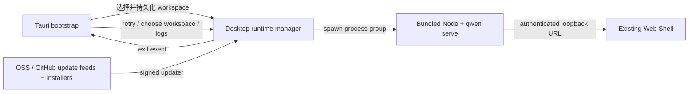

# Desktop Web Shell 发布设计

## 问题

当前桌面 PoC 已证明 Tauri 可以复用 daemon 提供的 Web Shell，而不需要维护第二套 UI。但 PoC 仍缺少公开发布所需的用户流程、故障恢复、签名更新、安全边界和三平台安装产物。

本设计把 `packages/desktop-shell` 完善为薄桌面壳：桌面壳只负责生命周期与平台集成，产品功能继续由 `qwen serve` 和 `@qwen-code/web-shell` 提供。

## 目标

- macOS、Windows、Linux 使用同一套 Web Shell UI。
- 首次启动允许用户选择工作区，后续启动恢复最近工作区。
- daemon 启动失败或运行中退出时提供可操作的恢复界面，而不是静默退出。
- 桌面壳只加载本地 bootstrap 页面与本机随机端口 daemon；外部 URL 始终交给系统浏览器。
- 发布产物带版本、来源、许可证、校验和和签名更新元数据。
- 公共 release 在 macOS 完成签名与公证，在 Windows 完成 Authenticode 签名；Linux 生成 AppImage 和 deb。

## 非目标

- 不新增桌面专属聊天 UI、会话模型或 daemon API。
- 不把 Web Shell 复制到桌面包中维护。
- 不实现多窗口、多工作区同时运行或后台常驻。
- 不承诺 Store 分发；首个公开版本使用 GitHub Releases。
- 不内置 Git、shell 或其他系统工具。缺失工具继续由现有 Web Shell 能力反馈。

## 架构



### 组件职责

| 组件            | 职责                                                               |
| --------------- | ------------------------------------------------------------------ |
| bootstrap 页面  | 启动状态、工作区选择、失败恢复、版本与日志入口                     |
| Rust 桌面状态   | 设置持久化、窗口状态、runtime 生命周期、单实例、更新状态           |
| bundled runtime | 当前平台 Node.js、Qwen Code bundle、Web Shell 静态资源             |
| 发布 CI         | 三平台构建、签名、公证、smoke、校验和、latest.json、GitHub Release |

## 启动状态机

| 状态              | 用户看到的内容                   | 可用操作                        |
| ----------------- | -------------------------------- | ------------------------------- |
| `starting`        | Qwen Code 品牌启动页和当前工作区 | 等待                            |
| `needs_workspace` | 首次启动工作区选择               | 选择目录                        |
| `ready`           | daemon-served Web Shell          | 正常使用                        |
| `failed`          | 精简错误摘要                     | 重试、选择其他目录、打开日志    |
| `stopped`         | daemon 意外退出提示              | 重启 daemon、选择目录、打开日志 |

应用先创建 bootstrap 窗口，再异步启动 daemon。daemon 深度健康检查（`/health?deep=true`）通过后，同一个窗口导航到 `http://127.0.0.1:<port>/#token=<token>`。token 只存在于 URL fragment 中，永远不会随请求发往服务端，因此不需要 cookie 握手，也不会进入 access log 或 Referer。这样慢启动和失败路径都有可见 UI。

必须使用深度健康检查：serve fast path 在真正的 runtime（含 Web Shell）挂载之前，就会用 bootstrap app 应答浅层 `/health`。此时 `/health?deep=true` 仍返回 `503 {"reason": "bootstrap"}`，因此只有它变为 200 才代表 Web Shell 可用；若用浅层健康检查判定就绪，导航会撞进 deferred runtime 窗口。

## 工作区选择与持久化

设置文件存储于 Tauri `app_config_dir` 下的 `desktop-state.json`：

```json
{
  "workspace": "/absolute/path",
  "window": {
    "width": 1280,
    "height": 820,
    "x": 120,
    "y": 80,
    "maximized": false
  }
}
```

启动优先级：

1. `QWEN_DESKTOP_WORKSPACE`，用于开发和自动化测试。
2. 设置文件中的最近工作区。
3. 首次启动显示目录选择器。

只有已存在且为目录的绝对规范路径会传给 daemon。选择新的工作区时先停止当前 process group，再用新目录重新启动。

## Runtime 生命周期与恢复

- 每次启动生成 256-bit bearer token，通过子进程环境（`QWEN_SERVER_TOKEN`）下发给 daemon，并通过 URL fragment（`/#token=<token>`）交给 Web Shell 前端；前端读取后从 URL 中清除，并以 `Authorization: Bearer` 头调用 API。fragment 不会发送到服务端，因此不需要 cookie。
- daemon 绑定 `127.0.0.1` 随机端口并启用 `--require-auth`。
- stdout 和 stderr 同时写入滚动日志，并保留有限启动摘要供 UI 展示。
- Rust 监视 daemon 进程退出；非应用退出导致的停止会触发 `runtime-stopped` 事件并返回 bootstrap 故障页。
- 重试始终创建新的 token 和 daemon，不复用已退出进程。
- 应用退出时终止整个子进程组，避免 orphan daemon。

## 窗口与单实例

- 主窗口最小尺寸 900 × 600，默认 1280 × 820。
- 关闭、移动、缩放和最大化状态持久化；恢复时将不可见屏幕外位置回退到居中。
- 单实例插件必须最先注册。第二次启动只聚焦并恢复主窗口，不再启动 daemon。

## 安全边界

- bootstrap CSP：`default-src 'self'; script-src 'self'; style-src 'self' 'unsafe-inline'; img-src 'self' data:; connect-src ipc: http://ipc.localhost; object-src 'none'; base-uri 'none'; form-action 'none'; frame-ancestors 'none'`。
- Web Shell 仍由 daemon 生成自身 CSP；桌面壳不放宽 daemon 页面策略。
- 主窗口只允许 bootstrap 自定义协议和选定 daemon 的同源导航。
- `http`、`https`、`mailto` 外链交给系统浏览器；`file`、`javascript`、自定义协议拒绝。
- blob 下载仅允许由主 Web Shell 发起，并由原生下载回调选择安全目标路径。
- Tauri 不暴露文件系统、shell 或 process JavaScript API；bootstrap 只使用显式 `invoke` command。
- Windows manifest 使用 `asInvoker`、Common Controls v6 和 long-path awareness。
- macOS hardened runtime 开启，entitlements 只包含运行 JIT WebView 与网络 client/server 所需能力。

## 构建元数据与合规

`prepare-runtime.js` 生成：

- `manifest.json`：桌面版本、Qwen Code 版本、Qwen Code commit、Node 版本、target、构建时间。
- `checksums.json`：所有 bundled runtime 文件的 SHA-256。
- 根 `LICENSE` 和桌面 `NOTICE`。
- Node.js `LICENSE`。

打包前 smoke 会校验 manifest、关键文件和 checksum。GitHub Release 同时发布每个安装产物的 `SHA256SUMS.txt`。

## 更新模型

Tauri updater 使用签名更新产物和固定公开 key。稳定发布的安装包和 updater 产物同时保存在 GitHub Releases 与 Aliyun OSS；应用优先检查 OSS 的小型更新清单，并在请求失败或超时时回退 GitHub。两个清单分别指向同一版本在各自源中的签名产物。应用启动后后台检查一次更新：

- 无更新：不打扰用户。
- 检查失败：写日志，不阻塞启动。
- 有更新：bootstrap/Web Shell 上方显示原生确认对话框；用户确认后下载并安装，然后重启。

发布 CI 使用 `TAURI_SIGNING_PRIVATE_KEY` 与 `TAURI_SIGNING_PRIVATE_KEY_PASSWORD` 生成 updater signatures。只有非 draft、非 prerelease 发布会更新 GitHub 的 `desktop-latest` feed，并在校验版本化 OSS 产物后更新 OSS feed。GitHub 始终保留为权威发布源和回退源。

## 平台发布矩阵

| 平台    | 架构       | 安装包                                | 签名要求                                |
| ------- | ---------- | ------------------------------------- | --------------------------------------- |
| macOS   | arm64、x64 | `.dmg`、`.app.tar.gz` updater         | Developer ID Application + notarization |
| Windows | x64        | NSIS `.exe` updater/installer         | Authenticode SHA-256 + timestamp        |
| Linux   | x64        | `.AppImage` updater/installer、`.deb` | updater minisign；无 OS code-signing    |

Windows WebView2 使用 download bootstrapper；系统离线且缺失 WebView2 时安装失败会明确提示依赖。Linux CI 安装 Tauri WebKit/GTK、AppImage 和 deb 构建依赖。

## 发布流程

1. 输入 desktop 版本和需要 vendor 的 Qwen Code ref。
2. 校验 ref 可追溯到允许发布的提交。
3. 同步 desktop-shell package、Cargo 和 Tauri 版本。版本仅在每次构建时由 CI 瞬时设置，不会提交回仓库；`main` 分支有意保持开发占位版本（`0.0.1`），已发布版本以 git tag 为准。
4. 每个平台准备 runtime，运行 checksum/runtime smoke 和 Rust 测试。
5. 构建安装包和 updater artifacts。
6. 平台 runner 安装并启动 packaged app，等待 daemon/Web Shell ready 证据。
7. 上传产物；发布 job 生成 `latest.json` 和 `SHA256SUMS.txt`。
8. 非 draft stable release 更新 GitHub `desktop-latest` feed，将同一批产物同步并校验到 OSS，再更新 OSS feed。

缺失签名密钥时只允许 `dry_run=true`，公开发布必须 fail closed。

## 验证标准

- 首次启动能选择目录并进入 Web Shell。
- 重启恢复工作区和窗口位置。
- 无效工作区、缺失 runtime、daemon 提前退出均显示恢复页。
- daemon 运行中被终止后，用户能在原窗口重启。
- 外链进入系统浏览器，主窗口不离开 daemon origin。
- 三平台 packaged app smoke 观测到 `/health`、未认证的 Web Shell root 导航返回 200（且不下发任何 cookie）、未携带 token 的 `/capabilities` 返回 401。
- updater manifest 签名可被客户端验证，版本回退被拒绝。
