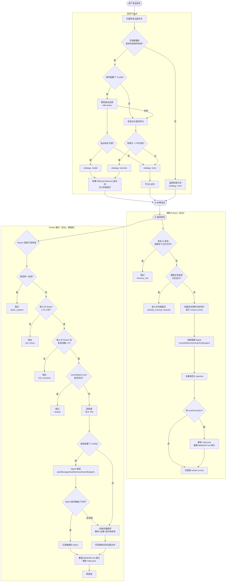
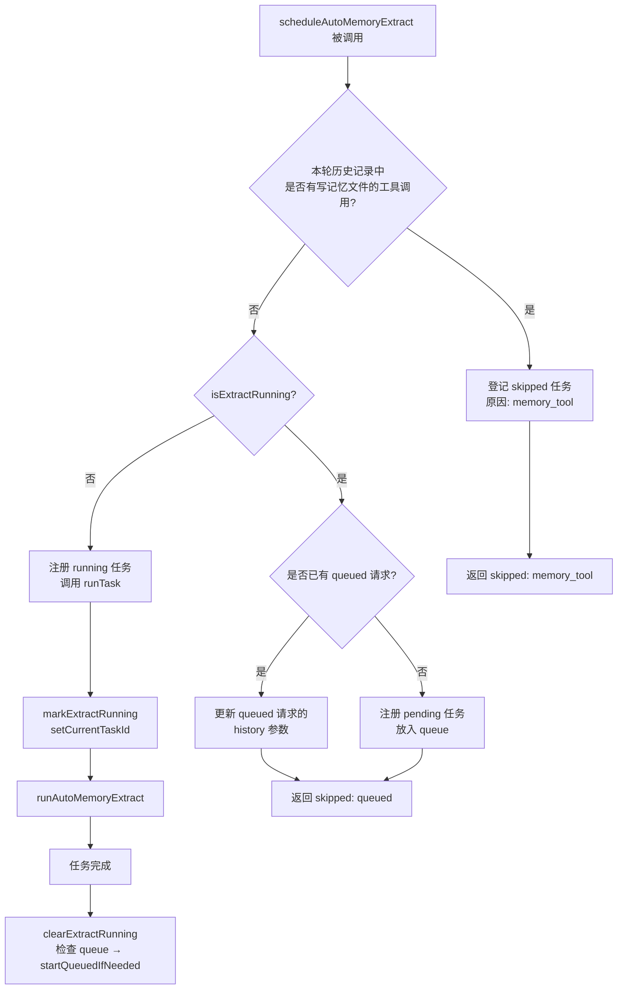
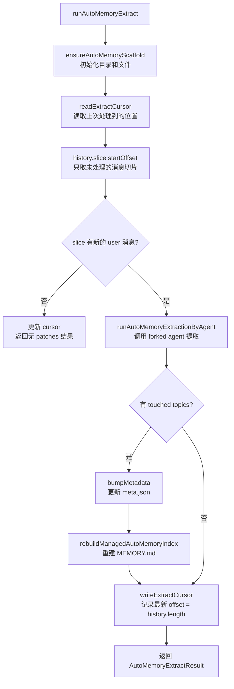
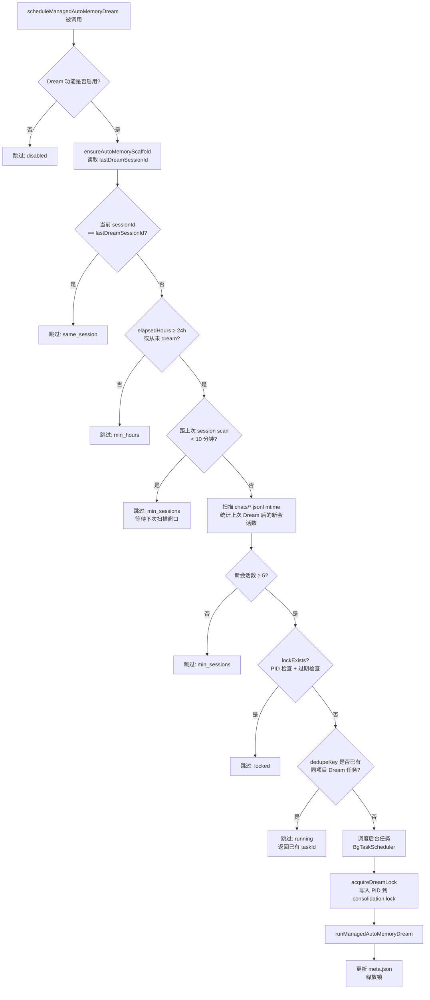
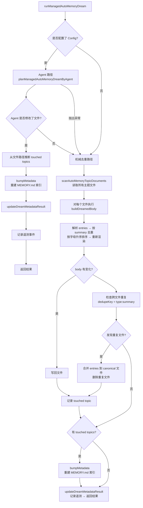
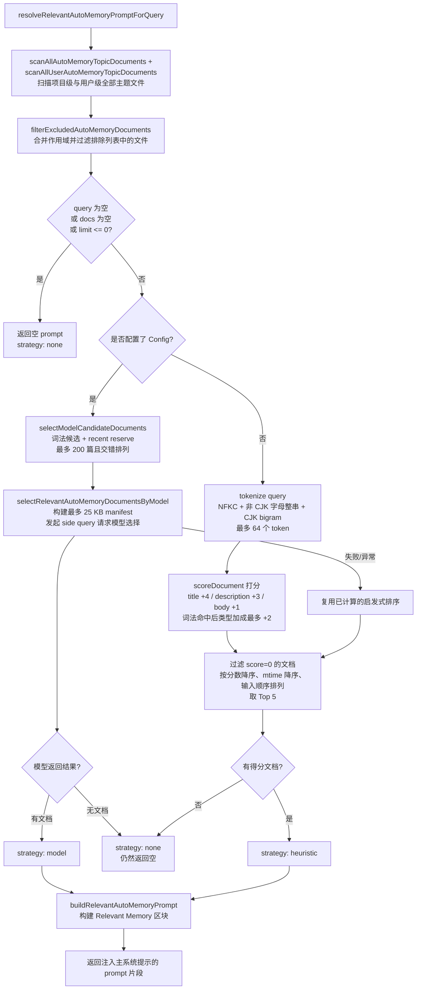
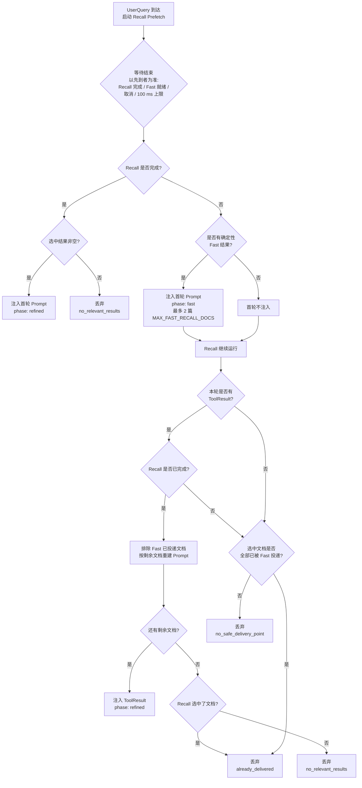
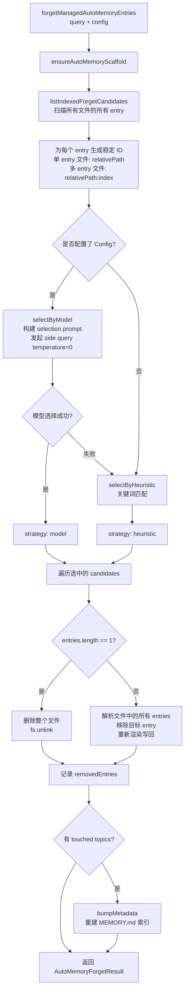

# Memory 记忆管理系统

> 本文介绍 Qwen Code 中 **Managed Auto-Memory**（托管自动记忆）的记忆管理机制、触发时机和实现细节。

---

## 目录

1. [概述](#概述)
2. [存储结构](#存储结构)
3. [记忆类型](#记忆类型)
4. [记忆条目格式](#记忆条目格式)
5. [核心生命周期](#核心生命周期)
6. [Extract — 提取](#extract--提取)
7. [Dream — 整合](#dream--整合)
8. [Recall — 召回](#recall--召回)
9. [Forget — 遗忘](#forget--遗忘)
10. [索引重建](#索引重建)
11. [遥测埋点](#遥测埋点)

---

## 概述

Managed Auto-Memory 是一套在 AI 会话过程中**自动**积累、整合和检索用户相关知识的持久化记忆系统。它通过四个核心操作维护记忆的生命周期：

| 操作 | 英文    | 触发方式                   | 作用                                   |
| ---- | ------- | -------------------------- | -------------------------------------- |
| 提取 | Extract | 自动（每轮对话后）         | 从对话记录中提炼新知识写入记忆文件     |
| 整合 | Dream   | 自动（周期性后台任务）     | 对记忆文件去重、合并，保持整洁         |
| 召回 | Recall  | 自动（每轮对话前）         | 检索与当前请求相关的记忆注入到系统提示 |
| 遗忘 | Forget  | 手动（用户命令 `/forget`） | 精确删除指定的记忆条目                 |

---

## 存储结构

### 目录布局

```
~/.qwen/                                      ← 全局基础目录（默认）
└── projects/
    └── <sanitized-git-root>/                 ← 项目标识（基于 Git 根路径）
        ├── meta.json                         ← 元数据（提取/整合时间戳、状态）
        ├── extract-cursor.json               ← 提取游标（已处理的对话偏移量）
        ├── consolidation.lock                ← Dream 进程互斥锁
        └── memory/                           ← 记忆主目录
            ├── MEMORY.md                     ← 索引文件（自动生成，汇总所有条目）
            ├── user.md                       ← 用户偏好记忆（示例）
            ├── feedback.md                   ← 反馈规范记忆（示例）
            ├── project/
            │   └── milestone.md              ← 项目记忆（支持子目录）
            └── reference/
                └── grafana.md                ← 外部资源记忆
```

> **环境变量覆盖**：
>
> - `QWEN_CODE_MEMORY_BASE_DIR`：替换全局基础目录
> - `QWEN_CODE_MEMORY_LOCAL=1`：改用项目内路径 `.qwen/memory/`
> - `QWEN_CODE_MEMORY_PROJECT_SCOPE=workspace`：按精确 workspace 目录分区项目记忆。`qwen serve` 未显式设置或值为空白时会注入 `workspace`；standalone CLI 仍默认按 Git 根目录共享。非空取值会做 trim / 小写归一，无法识别的值会告警一次并回退到 `git-root`。
>   - 团队记忆（`getTeamAutoMemoryRoot`）仍按 Git 根目录分区：同一 checkout 内的嵌套 workspace 仍共享团队记忆——团队记忆本就应跨 workspace 共享，不随本开关改变。
>   - 切换 scope 不做迁移：切到 `workspace` 后，此前写在 git-root key 下的项目记忆会“失联”（切回去则看不到 workspace key 下新写的内容）。
>   - 目录 key 由 `sanitizeCwd` 生成（非字母数字字符替换为 `-`），仅在标点上不同的兄弟目录（如 `feature_1` 与 `feature-1`）会映射到同一记忆目录；`workspace` 分区下这类命名会共享记忆，命名时需避开。
>   - 待处理任务上限（`MAX_PENDING = 16`）是**每个 lane** 的，N 个 workspace 即允许 16·N 个并发记忆任务，目前没有守护进程级总量上限。

### 关键文件说明

| 文件                  | 说明                                                                   |
| --------------------- | ---------------------------------------------------------------------- |
| `meta.json`           | 记录最后一次 Extract / Dream 的时间、会话 ID、涉及的记忆类型、执行状态 |
| `extract-cursor.json` | 记录当前会话已处理到对话历史的哪个偏移量，避免重复提取                 |
| `consolidation.lock`  | Dream 运行时的文件锁，内容为持有者 PID，超过 1 小时自动失效            |
| `MEMORY.md`           | 所有主题文件的索引，每次 Extract/Dream 后重建，格式为 Markdown 列表    |

---

## 记忆类型

系统支持四种内置记忆类型，每种对应不同的信息维度：

| 类型        | 存储内容                                              | 何时写入                                 | 何时读取                     |
| ----------- | ----------------------------------------------------- | ---------------------------------------- | ---------------------------- |
| `user`      | 用户的角色、技能背景、工作习惯                        | 了解到用户角色/偏好/知识背景时           | 回答需要根据用户背景定制时   |
| `feedback`  | 用户对 AI 行为的指导：避免什么、继续什么              | 用户纠正 AI 或确认某种非显而易见的做法时 | 影响 AI 行为方式时           |
| `project`   | 项目进展、目标、决策、截止日期、Bug 追踪              | 了解到谁在做什么、为什么、截止何时时     | 帮助 AI 理解工作背景和动机时 |
| `reference` | 外部系统资源指针（Dashboard、工单系统、Slack 频道等） | 得知某种外部资源及其用途时               | 用户提及外部系统或相关信息时 |

**不应该存入记忆的内容**：代码模式/约定、Git 历史、调试方案、临时任务状态、已在 QWEN.md/AGENTS.md 中记录的内容。

---

## 记忆条目格式

每个主题文件使用 **YAML frontmatter + Markdown body** 格式：

```markdown
---
name: 记忆名称
description: 一句话描述（用于判断召回相关性，要具体）
type: user|feedback|project|reference
---

记忆主体内容（summary 行）

Why: 背后原因（让 AI 能理解边界情况而不是盲目遵守规则）
How to apply: 适用场景和使用方式
```

对于 `feedback` 和 `project` 类型，强烈建议填写 `Why` 和 `How to apply`，使记忆在边界情况下仍能正确应用。

---

## 核心生命周期



---

## Extract — 提取

### 触发时机

每次 AI 完成一轮响应后，由 `scheduleAutoMemoryExtract` 自动触发（后台非阻塞）。

### 调度逻辑（`extractScheduler.ts`）



**跳过原因说明**：

| 原因              | 含义                                            |
| ----------------- | ----------------------------------------------- |
| `memory_tool`     | 本轮主 Agent 已直接写了记忆文件，跳过以避免冲突 |
| `already_running` | 提取正在进行且无法入队                          |
| `queued`          | 已有提取在运行，本次请求已入队                  |

### 核心提取流程（`extract.ts`）



> **注意：** `isUnderMemoryPressure` 门控位于 `MemoryManager.runExtract()` 中，不在本流程内。当 monitor 报告 hard/critical 压力时，`MemoryManager` 会跳过 extract 调用，不推进 cursor。

**提取游标（Cursor）**：

- 字段：`{ sessionId, processedOffset, updatedAt }`
- 提取前先通过 `readExtractCursor` 读取当前进度，再用 `history.slice(processedOffset)` 仅处理未读部分
- 每次提取后更新 `processedOffset` 为当前历史长度（`params.history.length`）
- 跨会话时（`sessionId` 变化）从偏移量 0 重新开始
- 注意：不再通过 `buildTranscriptMessages` / `loadUnprocessedTranscriptSlice` 构建转录文本——`hasNewUserMessages` 通过 `history.slice(startOffset).some(m => m.role === 'user' && partToString(m.parts).trim().length > 0)` 判断，仅在未读切片上做轻量字符串化，全量历史不再处理

**Patch 过滤规则**：

- 摘要长度 < 12 字符 → 丢弃
- 摘要以 `?` 结尾 → 丢弃（疑问句）
- 包含临时性关键词（today/now/currently/temporary 等）→ 丢弃
- 相同 `topic:summary` 组合 → 去重

---

## Dream — 整合

### 触发时机

每次 AI 完成一轮响应后，由 `scheduleManagedAutoMemoryDream` 自动触发（后台非阻塞）。但受多个门控条件保护，大多数情况下会被跳过。

### 调度门控（`dreamScheduler.ts`）



**门控参数**：

| 参数                       | 默认值   | 说明                          |
| -------------------------- | -------- | ----------------------------- |
| `minHoursBetweenDreams`    | 24 小时  | 两次 Dream 之间的最小时间间隔 |
| `minSessionsBetweenDreams` | 5 个会话 | 触发 Dream 所需的最小新会话数 |
| `SESSION_SCAN_INTERVAL_MS` | 10 分钟  | 会话文件扫描的节流间隔        |
| `DREAM_LOCK_STALE_MS`      | 1 小时   | lock 文件被视为过期的时间阈值 |

**锁机制**：

- lock 文件位于 `<project-state-dir>/consolidation.lock`
- 内容为持有进程的 PID
- 检查时：若 PID 进程已不存在（`kill(pid, 0)` 失败）或 lock 超过 1 小时 → 视为过期，自动清除

### 整合执行流程（`dream.ts`）



**机械去重逻辑**：

1. 对每个主题文件内部：按 `summary.toLowerCase()` 去重，合并 `why`/`howToApply` 字段
2. 按 summary 字母顺序重新排序
3. 跨文件：相同 `type:summary` 的条目合并到最先发现的文件，删除重复文件

---

## Recall — 召回

### 触发时机

每轮 AI 处理用户请求之前，由 `resolveRelevantAutoMemoryPromptForQuery` 自动触发，将相关记忆注入系统提示词。

### 召回流程（`recall.ts`）



> **关于 200 上限：这是换了截断依据，不是抬高了天花板。** 旧路径按 scope 各自
> 保留最近 200 篇，截断发生在看 query 之前；新路径先扫全量，再按词法相关性 +
> recency reserve 选出最多 200 篇候选。因此效果分三档：总量 ≤200 时两者都不按
> 数量丢弃（但新增了 25 KB manifest 上限，长 description 场景可能被截）；总量
> 在 200–400 且单个 scope 不超 200 时，旧路径会把全部（最多 400 篇）送给
> Selector，新路径最多 200 篇，且实测中 25 KB 的 manifest 预算会先于数量上限
> 生效——150+150 篇的实测里旧路径送 300 行、新路径只送 94 行，**候选变少的幅度
> 比数量上限暗示的更大**；只有单个 scope 超过 200 时，
> 才是这次真正要解决的场景——旧的 recency 上限会让老而相关的文档永久不可见。
> 详见 `docs/design/2026-08-09-bounded-memory-recall-candidates.md`。

**评分规则（启发式）**：

| 条件                                       | 加分                |
| ------------------------------------------ | ------------------- |
| query token 出现在 title                   | +4（每个 token）    |
| query token 出现在 description             | +3（每个 token）    |
| query token 出现在 body 前 1200 字符       | +1（每个 token）    |
| 至少一次词法命中后，token 是类型特征关键词 | +1，整篇文档最多 +2 |

> **Tokenize 规则**：NFKC 归一化并转小写后，Han/Hiragana/Katakana/Hangul 连续片段
> 按 code point bigram 切分（单字不产生 token）；其余至少 3 个字母、组合符或数字的
> 连续片段整串保留。后者基于 `\p{L}` 而非 `[a-z0-9]`，因此西里尔、希腊、阿拉伯和
> 带重音拉丁文都能产生 token。CJK 是**逐字符**排除的，不能只依赖正则分支顺序——
> `\p{L}` 也匹配 Han，否则 `abc漢字` 会被并成一个 token。Thai/Khmer/Lao 这类
> 无分词符又不在 CJK 集合内的文字，会整段变成一个 token：比之前完全没有 token 强，
> 但不是分词。
>
> **同分排序**：按 mtime 降序，再按输入顺序（稳定排序），**不按 type**。

**每种类型的特征关键词**：

- `user`：user, preference, background, role, terse
- `feedback`：feedback, rule, avoid, style, summary
- `project`：project, goal, incident, deadline, release
- `reference`：reference, dashboard, ticket, docs, link

**Prompt 构建规则**：

- 单次注入最多 5 篇文档（`MAX_RELEVANT_DOCS`）
- 每篇文档 body 截断至 1200 字符（`MAX_DOC_BODY_CHARS`）
- 超出截断时追加提示："NOTE: Relevant memory truncated for prompt budget."
- 包含文档的新鲜度信息（基于文件 mtime）

> **`MAX_RELEVANT_DOCS` 限制的是单次注入，不是单轮总量。** Fast 阶段投递 2 篇、
> ToolResult 阶段又投递 5 篇全新文档时，本轮进入模型的是 **7 篇**——去重只消除
> 重复，不压缩总和。这是放弃跨阶段预算核算的有意结果（见
> `2026-08-08-native-memory-recall-reliability.md`）：两次 Prompt 各自有界，
> 每篇 body 仍截断到 1200 字符，Fast 上限为 2，因此最坏情况有界且不大，只是不等于 5。

### 投递时机（Delivery）

"选中了 Memory" 不等于 "主模型看到了 Memory"。Recall 在 UserQuery 到达时异步启动，
投递发生在两个时机：



**为什么需要 Fast 阶段**：当存在 Config 时 Recall 会等待 Model Selector，
而它是一次网络 Side Query（中止上限 30 秒），因此 100 ms 预算通常会超时。
若没有 Fast 阶段，**没有工具调用的轮次将完全拿不到 Memory**——而这正是
用户级 Memory 最重要的场景。Fast 结果复用 `selectModelCandidateDocuments`
为 Model Manifest 已经算好的候选，不产生额外扫描或 I/O。

**100 ms 是上限而不是固定开销**：Fast 结果在 Recall 扫完 Memory 树之后才发布，
所以真正决定它能否赶上的是**扫描耗时**，不是打分耗时（后者是微秒级）。
`recall-scan-latency.test.ts` 在真实临时 Memory 树上实测：200 篇约 29 ms、
500 篇约 70 ms、1000 篇约 130 ms。对能在预算内扫完的树（普通用户的常见情况），
Fast 就绪后继续等待只是在等一个本设计已经假定赶不上的 Model Selector，
因此等待会在 Fast 就绪时立即结束。超过约 1000 篇时扫描本身就超预算，
该轮会付满 100 ms 且什么都投不到——提前结束等待只能把这种情况**限制住**，
消除不了它。

**Fast 阶段的边界**：Fast 结果就是确定性结果，因此它只能解决**时机**问题，
解决不了**匹配**问题。与文档没有任何词面重叠的 Query 产生不了 Fast 结果，
这类 Query 在无工具回合仍然拿不到 Memory——只有 Model Selector 能覆盖它们，
而无工具回合等不到 Selector。语料中的 `semantic-no-lexical` 分片专门测量这一点。

**去重**：两个阶段来自同一次扫描，Model Selector 并未把 Fast 文档视为已排除，
因此 ToolResult 投递前必须过滤掉 Fast 已投递的 `filePath` 并重建 Prompt。

**丢弃口径**：同一条规则也适用于取消路径。若最终选中的文档已被 Fast 阶段
全部投递，无论本轮是因为无工具调用、New Query、Reset、Abort 还是 Shutdown
结束，都记为 `already_delivered` 而不是对应的取消原因——否则「Memory 从未
到达模型」这一桶会被实际已送达的回合灌水。只有部分重叠时仍记取消原因，
因为不在 Fast 集合里的那些文档确实没有投递点。

---

## Forget — 遗忘

### 触发时机

由用户手动执行 `/forget <query>` 命令触发。

### 遗忘流程（`forget.ts`）



**Entry ID 设计**：

- 单条目文件（常见情况）：`relativePath`（如 `feedback/no-summary.md`）
- 多条目文件：`relativePath:index`（如 `feedback/style.md:2`）
- 使用稳定 ID 使模型可以精确定位条目而不影响同文件的其他条目

---

## 索引重建

`MEMORY.md` 是所有主题文件的导航索引，每次 Extract 或 Dream 后调用 `rebuildManagedAutoMemoryIndex` 重建：

```
- [用户偏好](user/preferences.md) — 用户是资深 Go 工程师，第一次接触 React
- [反馈规范](feedback/style.md) — 保持回复简洁，不要尾部总结
- [项目里程碑](project/milestone.md) — 移动端发布切分支前的合并冻结窗口
```

**索引限制**：

- 每行最多 150 字符（超出用 `…` 截断）
- 最多 200 行
- 总大小不超过 25,000 字节

---

## 遥测埋点

系统内置三类遥测事件，用于监控记忆操作的性能和效果：

### Extract 遥测

| 字段             | 类型                        | 说明                    |
| ---------------- | --------------------------- | ----------------------- |
| `trigger`        | `'auto'`                    | 触发方式（当前仅自动）  |
| `status`         | `'completed'` \| `'failed'` | 执行结果                |
| `patches_count`  | number                      | 提取到的有效 patch 数量 |
| `touched_topics` | string[]                    | 被写入的记忆类型列表    |
| `duration_ms`    | number                      | 总耗时（毫秒）          |

### Dream 遥测

| 字段              | 类型                                  | 说明                   |
| ----------------- | ------------------------------------- | ---------------------- |
| `trigger`         | `'auto'`                              | 触发方式               |
| `status`          | `'updated'` \| `'noop'` \| `'failed'` | 执行结果               |
| `deduped_entries` | number                                | 机械路径去重的条目数量 |
| `touched_topics`  | string[]                              | 被修改的记忆类型列表   |
| `duration_ms`     | number                                | 总耗时（毫秒）         |

### Recall 遥测

| 字段            | 类型                                   | 说明             |
| --------------- | -------------------------------------- | ---------------- |
| `query_length`  | number                                 | 查询字符串长度   |
| `docs_scanned`  | number                                 | 扫描的文档总数   |
| `docs_selected` | number                                 | 最终注入的文档数 |
| `strategy`      | `'none'` \| `'heuristic'` \| `'model'` | 选择策略         |
| `duration_ms`   | number                                 | 总耗时（毫秒）   |

### Recall Delivery 遥测

记录选中的 Memory 是否真的送达主模型（Selection 事件无法回答这个问题）。

| 字段             | 类型                                                                                                                                      | 说明                                                       |
| ---------------- | ----------------------------------------------------------------------------------------------------------------------------------------- | ---------------------------------------------------------- |
| `phase`          | `'fast'` \| `'refined'`                                                                                                                   | **投递阶段**                                               |
| `delivery_point` | `'initial'` \| `'tool_result'` \| `'discarded'`                                                                                           | 投递位置                                                   |
| `discard_reason` | `'no_safe_delivery_point'` \| `'new_query'` \| `'reset'` \| `'abort'` \| `'shutdown'` \| `'no_relevant_results'` \| `'already_delivered'` | 丢弃原因                                                   |
| `strategy`       | `'none'` \| `'heuristic'` \| `'model'`                                                                                                    | **选择方式**                                               |
| `docs_selected`  | number                                                                                                                                    | 结果文档数（投递事件为实际投递数；discarded 事件为选中数） |
| `latency_ms`     | number                                                                                                                                    | 自发起的耗时                                               |

> **`phase` 与 `strategy` 正交，互不替代。** `phase` 描述**何时**送达：`fast` 是预算
> 超时后注入的确定性结果，`refined` 是 Model Selector 选出的结果。`strategy` 描述
> **如何**选出。`fast` 投递必然是 `heuristic`；`refined` 投递常规为 `model`，
> 在 Selector 失败走 Fallback 时为 `heuristic`。仅凭 `strategy` 判断阶段，
> 会把"确定性结果先到"与"Selector 故障"混为一谈。

---

## 相关源文件索引

| 文件                                                 | 职责                                                                          |
| ---------------------------------------------------- | ----------------------------------------------------------------------------- |
| `packages/core/src/memory/types.ts`                  | 类型定义：`AutoMemoryType`、`AutoMemoryMetadata`、`AutoMemoryExtractCursor`   |
| `packages/core/src/memory/paths.ts`                  | 路径计算：`getAutoMemoryRoot`、`isAutoMemPath`、各类文件路径 helpers          |
| `packages/core/src/memory/store.ts`                  | 脚手架初始化：`ensureAutoMemoryScaffold`，索引/元数据读写                     |
| `packages/core/src/memory/scan.ts`                   | 扫描主题文件：`scanAutoMemoryTopicDocuments`，解析 frontmatter                |
| `packages/core/src/memory/entries.ts`                | 条目解析和渲染：`parseAutoMemoryEntries`、`renderAutoMemoryBody`              |
| `packages/core/src/memory/extract.ts`                | 提取核心逻辑：`runAutoMemoryExtract`，游标管理，patch 去重                    |
| `packages/core/src/memory/extractScheduler.ts`       | 提取调度器：`ManagedAutoMemoryExtractRuntime`，队列/运行状态机                |
| `packages/core/src/memory/extractionAgentPlanner.ts` | 提取 Agent：`runAutoMemoryExtractionByAgent`                                  |
| `packages/core/src/memory/dream.ts`                  | 整合核心逻辑：`runManagedAutoMemoryDream`，Agent 路径 + 机械去重              |
| `packages/core/src/memory/dreamScheduler.ts`         | 整合调度器：`ManagedAutoMemoryDreamRuntime`，门控检查，锁管理                 |
| `packages/core/src/memory/dreamAgentPlanner.ts`      | 整合 Agent：`planManagedAutoMemoryDreamByAgent`                               |
| `packages/core/src/memory/recall.ts`                 | 召回逻辑：`resolveRelevantAutoMemoryPromptForQuery`，启发式+模型双路径        |
| `packages/core/src/memory/forget.ts`                 | 遗忘逻辑：`forgetManagedAutoMemoryEntries`，候选生成+精确删除                 |
| `packages/core/src/memory/indexer.ts`                | 索引重建：`rebuildManagedAutoMemoryIndex`，`buildManagedAutoMemoryIndex`      |
| `packages/core/src/memory/prompt.ts`                 | 系统提示模板：记忆类型说明、格式示例、使用规范                                |
| `packages/core/src/memory/governance.ts`             | 治理建议类型：`AutoMemoryGovernanceSuggestionType`                            |
| `packages/core/src/memory/state.ts`                  | 提取运行状态：`isExtractRunning`、`markExtractRunning`、`clearExtractRunning` |
| `packages/core/src/memory/memoryAge.ts`              | 新鲜度描述：`memoryAge`、`memoryFreshnessText`                                |
