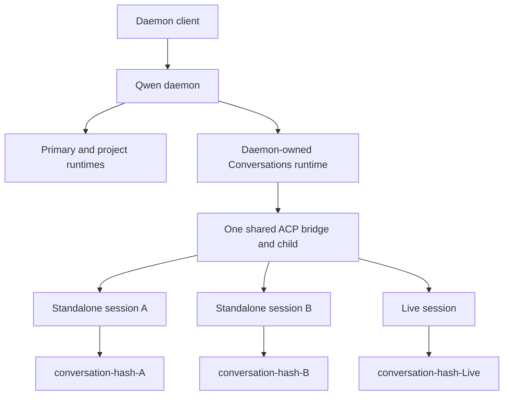
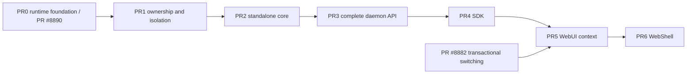

# Standalone Daemon Sessions

## Status

This document is the versioned architecture companion to
[Issue #8908](https://github.com/QwenLM/qwen-code/issues/8908), which is the
source of truth for the standalone-session design and delivery plan.
[PR #8890](https://github.com/QwenLM/qwen-code/pull/8890) is implementation PR0,
not a documentation-only gate: it keeps this document synchronized while
delivering the Conversations runtime foundation. The remaining ownership,
standalone core, capability, SDK, WebUI, and WebShell work is delivered in PR1
through PR6 below.

The design builds on the projectless conversation infrastructure introduced for
Live Voice. It does not authorize a second projectless runtime, a second session
catalog, or a child process per standalone session.

This contract extends, and does not replace, the projectless runtime decisions
in [WebShell Live Voice Codex-Parity Refactor Contract](./web-shell-live-voice-codex-parity-refactor.md).

## Problem

The daemon currently treats its primary workspace as the implicit target when a
client creates a session without `cwd`. This makes the top-level **New Chat**
action project-bound even when the user has not selected a project. It also
exposes the lifetime of that project directory as the lifetime of the chat. If
the directory is moved or removed, the client can only report that the current
working directory no longer exists.

Live Voice already owns a secure projectless storage root at
`~/Documents/Qwen Code/Conversations`, publishes one daemon-owned runtime for
that root, and relocates each Live session into a deterministic private child
directory. Standalone sessions generalize that substrate into a normal text-chat
product surface while preserving Live-specific behavior.

## Goals

- Let a user create and continue a normal text session without selecting a
  workspace.
- Make top-level **New Chat** create a standalone session while keeping
  project-local **New Chat** project-bound.
- Give every standalone session a durable private working directory with normal
  Qwen Code tools and approvals.
- Support creation, listing, exact lookup, load, resume, rename, export, archive,
  unarchive, repair, and deletion across daemon restarts.
- Keep standalone, workspace, and Live contexts explicit throughout the SDK and
  WebShell.
- Reuse the Conversations runtime, ACP bridge, transcript catalog, admission
  limits, and permission pipeline.
- Allow only one daemon process at a time to own the user-level Conversations
  runtime.
- Fail closed when an internal runtime or managed directory cannot be validated;
  never fall back to the primary workspace.

## Non-goals

- An operating-system sandbox or a stronger filesystem boundary than the
  existing approval policy.
- A separate ACP child per standalone session.
- Standalone attachments, durable scheduled tasks, storage quotas, retention
  policy, or general orphan cleanup beyond deletion recovery.
- Moving or forking a standalone session into a project.
- Cascading archive or deletion from parent sessions to child sessions.
- Git branches, worktrees, repository status, or project settings for standalone
  sessions.
- Changing Live Voice product semantics, Realtime behavior, or its tool surface.
- Multi-master ownership, proxying between daemon processes, or guaranteed
  mixed-version concurrent access to the Conversations root.

## Product contract

### Explicit session contexts

WebShell models the user-visible context as a discriminated value:

```ts
type SessionContext =
  | { kind: 'standalone' }
  | { kind: 'workspace'; cwd: string }
  | { kind: 'live' };
```

Clients derive this value from the operation they perform and the persisted
session source returned by the daemon. They must not infer product semantics
from `workspaceCwd`. The legacy field may be accepted only at a workspace
compatibility boundary and must be normalized immediately into an explicit
workspace context. For protocol compatibility, a standalone session still has
an internal `workspaceCwd`, but that value is a routing detail identifying the
daemon-owned Conversations runtime and must not be displayed as a project or
used to select standalone context.

The entry-point behavior is fixed:

| Entry point                                      | New-session context      |
| ------------------------------------------------ | ------------------------ |
| Top-level home and global **New Chat**           | `standalone`             |
| **New Chat** within a selected or locked project | `workspace`              |
| Goals and Git entry points                       | `workspace`              |
| Current-session **New Chat**                     | Inherit explicit context |
| Live Voice                                       | `live`                   |

Standalone sessions appear in a top-level **Recents** group separate from Live
and project groups. Their chat surface hides workspace selection, Git status,
branch and worktree controls, project files, project settings, pin/group
controls, and attachments/uploads. Normal model, approval, tool, permission,
transcript, and supported session metadata controls remain available.

### Persisted source

New top-level standalone transcripts persist `sourceType: "standalone"` with no
`sourceId` and no `parentSessionId`. Live sessions retain their current
`sourceType: "default"` and `sourceId: "realtime_voice:<call-id>"` provenance.

`standalone` is a daemon-reserved source. Generic `POST /session` creation must
reject it, just as it rejects the reserved Live source. Classification requires
both compatible source metadata and ownership by the validated Conversations
runtime; source metadata alone can never turn a project session into a
standalone session.

Existing top-level Conversations transcripts with no parent, no source ID, and
either no source type or `sourceType: "default"` are normalized as legacy
standalone sessions at read time. Their transcripts are not rewritten. A source
that is explicitly Live or belongs to another feature is never silently
reclassified.

`create_sub_session` invoked by a standalone session explicitly persists
`sourceType: "standalone"` together with `parentSessionId`. Children remain
loadable by identity but are excluded from top-level Recents. Parent and child
archive or deletion operations do not cascade; each transcript and private
directory has an independent lifecycle.

PR2 extends the relocated source-classification helper so Live task list, read,
wait, and follow-up operations treat explicit and legacy standalone sessions as
loadable projectless task targets. It accepts top-level explicit standalone
sources with no `sourceId` and standalone children resolved through their parent
chain. This does not relabel them as Live in WebShell and does not expose
Live-only tools in their ordinary text turns. Projectless Live task creation
must use the same standalone creation service instead of creating new legacy
`sourceType: "default"` sessions.

## Runtime architecture



### One Conversations runtime

Introduce one one-flight `ConversationRuntimeManager` per daemon. It lazily
validates the Conversations root and ensures the registered runtime and ACP
bridge even when Live Voice is disabled. `ensure()` does not preheat the bridge
or start the Qwen ACP child; the first operation that actually needs an ACP
session starts the one shared child. Live enablement only binds and advertises
Live-specific Host, Appshot, Realtime, speech, and task channels; it does not own
the manager or the underlying runtime lifetime. Concurrent ensure failures reset
the one-flight so a later request can retry initialization.

The existing internal runtime provenance value `live-conversation` is retained
for compatibility in the first implementation. Within daemon routing it means
"daemon-owned Conversations runtime" and must not be used to classify a session
as Live. Persisted session source performs that classification. Renaming the
runtime provenance is unnecessary for this feature and would expand the change
without changing behavior.

Each workspace runtime owns one ACP bridge and a lazily started child process.
Standalone and Live sessions therefore share the Conversations runtime's ACP
child after first use. Session admission remains subject to the daemon's total
and per-runtime limits. One healthy ACP child is a steady-state ownership
invariant; a bounded overlap during crash replacement or teardown is not treated
as a second runtime.

### Cross-daemon ownership

The Conversations root is user-global, while multiple `qwen serve` processes
can run concurrently. In-process one-flight and per-session locks are therefore
insufficient.

- Before publishing or using the runtime, acquire a secure process-owner record
  using the atomic-write, nonce, PID-liveness, owner/mode, and fail-closed
  patterns already used by Live discovery.
- Store the record in a stable user runtime location independent of a custom
  project runtime base. Serialize replacement with `proper-lockfile`.
- Reclaim only a dead owner, wait a short drain grace before starting a
  replacement ACP child, and treat PID reuse as active and fail-closed.
- Release ownership only after routes, sessions, bridge, and child teardown have
  drained, and only if the record nonce still matches.
- An active foreign owner returns `503 conversation_runtime_in_use`. Malformed
  or unsafe ownership state returns
  `503 conversation_runtime_ownership_compromised`.
- Capability advertisement describes support rather than current owner
  availability. An ownership error never permits fallback to the primary
  runtime.

Acquisition also respects an already-running legacy Live discovery owner. A
pre-feature daemon started after a new standalone owner cannot be made to honor
the new record, so concurrent mixed-version access is explicitly unsupported.

### Managed working directories

The existing conversation workspace creates a deterministic direct child for
each session:

```text
~/Documents/Qwen Code/Conversations/conversation-<sha256(session-id)>
```

The root and child must be real directories owned by the daemon user. On POSIX,
they must not grant group or other permissions. The daemon validates the root's
canonical path, device, and inode before and after sensitive operations, and it
requires each session directory to be an exact direct child. Symbolic links,
junction/reparse escapes, path traversal, non-direct descendants, and identity
changes are rejected.

Device and inode identity are pinned for both the root and every materialized
session child for one daemon ownership lifetime. The owner keeps each child's
validated identity by session ID and compares it before every later use; an
owned `0700` directory substituted at the same path is still compromised.
Identity may be established only at first materialization, after a daemon
restart with no pending deletion journal, or when load, resume, or explicit
repair recreates a path proven absent while holding the lifecycle coordinator.
Archive does not reset it, and the normal-to-staged deletion rename preserves
it. After a restart, a securely recreated root and child at the expected
canonical paths may be accepted only after recovery journals have been
reconciled; the feature does not promise persistent inode attestation across
clean restarts. Windows validates canonical path and link/reparse behavior
exposed by the platform without claiming POSIX owner/mode or ACL guarantees.

Daemon-managed transcripts and sidecars remain in the daemon runtime base's
per-runtime storage keyed by the canonical Conversations runtime cwd (under the
default user-global base unless the daemon explicitly selects another runtime
base). User-authored Conversations-root configuration remains under that root.
Neither is moved into the session's private child, which is only the effective
tool and shell working directory. Managed relocation updates the effective
target directory and workspace context without changing transcript ownership.

User/global settings and user-authored Conversations-root configuration
continue to apply. A child may inherit ancestor `QWEN.md`/`AGENTS.md` and shared
Conversations-root MCP/config state. Primary-project settings, memory, Git
state, trust, and cwd must not leak. The design must not describe shared
user-level or Conversations-root configuration as per-session private.

### Permission boundary

The private directory is a stable default working directory, not an OS sandbox.
Relative file and shell operations begin there and normal workspace-aware tools
receive that directory as session context. An explicit operation targeting an
absolute path outside it remains governed by the existing permission and
approval pipeline. This feature does not claim containment that the current
tooling cannot enforce.

### Internal runtime isolation

The Conversations root is not a user workspace. Use a default-deny user-workspace
resolver and a separate explicit internal resolver. Generic registration,
settings, trust, Git, files, shell, extensions, skills, MCP control, memory
control, workspace voice, and workspace-qualified ACP WebSocket routes must
reject a request that resolves to the internal runtime. Generic channel and
scheduled-task administration is also denied. Compatibility exceptions preserve
the existing Live behavior on the workspace-qualified surfaces: channel
management remains read-only, and Live-owned scheduled tasks retain list,
update, delete, and manual-run access. These exceptions authorize only Live
state and do not expose standalone sessions or standalone durable scheduling.

Audit every direct registry consumer, including HTTP routes, ACP and voice
WebSocket upgrades, capabilities, session creation and restore, workspace
management, health, and Live task services. Only owner-routed session
operations, transcript/catalog operations, health/capabilities, and dedicated
Live or standalone services may opt in. The compatibility `kind: "live"`
runtime entry may remain temporarily, but new clients exclude it from project
selectors and generic route denial remains mandatory.

An unknown, bootstrapping, untrusted, compromised, draining, or removed
Conversations runtime returns an error. It must never resolve to or retry against
the primary runtime.

## Daemon and SDK contract

### Capability

The daemon advertises `standalone_sessions_v1` in `GET /capabilities` only when
the complete manager, service, route, and managed-directory lifecycle dependency
set is installed, including embedded `createServeApp` configurations. A build
constant alone is insufficient. PR0 through PR2 remain behaviorally hidden; PR3
is the atomic advertisement boundary.

The capability is not coupled to Live Voice availability or enablement and
describes support rather than current cross-daemon ownership availability. Root
materialization remains lazy, so a missing but creatable root does not suppress
advertisement. Once advertised, initialization or ownership errors are returned
as structured failures and never trigger primary fallback.

### Routes

The dedicated API is:

```text
POST  /standalone/sessions
GET   /standalone/sessions
GET   /standalone/sessions/:id
POST  /standalone/sessions/:id/load
POST  /standalone/sessions/:id/resume
POST  /standalone/sessions/:id/repair-directory
PATCH /standalone/sessions/:id/metadata
GET   /standalone/sessions/:id/export
POST  /standalone/sessions/archive
POST  /standalone/sessions/unarchive
POST  /standalone/sessions/delete
```

Dedicated routes prevent omission of `cwd` from silently selecting the primary
runtime. They also let SDK clients distinguish an unsupported old daemon from a
failed standalone operation.

Creation accepts only:

```ts
interface CreateStandaloneSessionRequest {
  sessionId: string;
  modelServiceId?: string;
  approvalMode?: DaemonApprovalMode;
}
```

The wire-level UUID is required and validates as UUID v1 through v5. An SDK
convenience method may omit it only if the SDK generates the UUID before sending
the request. The daemon fixes `sessionScope` to `thread` and source to
`standalone`. Unknown keys are rejected, including `cwd`, `workspaceCwd`,
`workspaceId`, `sourceType`, `sourceId`, `sessionScope`, `branch`, and
`worktree`.

`GET /standalone/sessions/:id` is the non-mutating exact-identity lookup used for
response-loss recovery and deep links:

- Return `202` with `state: "creating"` while the UUID reservation is in flight.
- Return `200` with an active or archived summary when a compatible transcript
  exists.
- Return `404 standalone_session_not_found` when the UUID is absent or belongs
  to another context. A retained deletion journal does not make the deleted
  session discoverable; cleanup resumes through owner acquisition or an exact
  delete retry. Lookup never reveals or guesses another runtime.
- Return structured ownership, root, or compromise errors when lookup cannot be
  performed safely.

Load and resume use `Omit<RestoreSessionRequest, 'workspaceCwd'>`: they retain
the existing approval, history-page, and client timeout options while the route
selects the owner runtime and private directory. Repair has no request body.
Rename and export use dedicated routes so cold and archived transcripts work
without exposing the internal runtime through workspace-qualified APIs. Active
rename additionally notifies the live bridge.

Listing reuses the existing cursor, size, and archive-state semantics. It
includes explicit and compatible legacy top-level sessions, excludes Live and
project sessions and every child, and does not probe working-directory state.
Archive, unarchive, and delete accept the existing bounded, de-duplicated
`sessionIds` array. Batch errors use `{ sessionId, code, message }`. Successful
delete returns `removed`, `notFound`, `errors`, and `fileCleanupPending`;
`fileCleanupPending` is a subset of `removed` because the transcript is already
gone.

Prompt, cancel, subscribe, permission, transcript, status, and other live
session-ID routes retain owner routing after load. Persisted or cold operations
that cannot be satisfied from the live owner index use the standalone service,
not the primary runtime.

### SDK types

The SDK exposes narrow create, restore, and summary results using common fields:

```ts
interface DaemonStandaloneFields {
  sourceType: 'standalone';
  context: { kind: 'standalone' };
  workingDirectory: {
    state: 'ready' | 'recreated';
    warnings?: string[];
  };
}

interface DaemonStandaloneSession
  extends DaemonSession,
    DaemonStandaloneFields {}

interface DaemonRestoredStandaloneSession
  extends DaemonRestoredSession,
    DaemonStandaloneFields {}

interface DaemonStandaloneSessionSummary extends DaemonSessionSummary {
  sourceType: 'standalone';
  context: { kind: 'standalone' };
}
```

Create returns `DaemonStandaloneSession`; load and resume return
`DaemonRestoredStandaloneSession`. A recreated directory warning means the
transcript survived but files previously stored in the directory are not
recoverable. Standalone list summaries expose the explicit context and source
but do not probe or return working-directory state.

The existing internal `workspaceCwd` field remains required on base daemon
session types for routing and backward compatibility. Standalone SDK methods do
not accept it as input, and WebShell does not expose it as a project.

The SDK provides capability-gated create, list, exact get, load, resume, repair,
rename, export, archive, unarchive, and delete methods. It generates the UUID
before create, exposes that UUID on either a structured
`standalone_creation_outcome_unknown` response or an outcome-unknown transport
error, performs exact lookup, and never retries creation automatically.
`DaemonSessionClient` stores an explicit restore strategy: workspace sessions
restore by cwd, while standalone sessions use the dedicated route. Daemon
responses are runtime-validated in both browser and Node builds.

## Lifecycle and consistency

### Creation transaction

The SDK generates a UUID before sending the request. Creation proceeds as one
logical transaction:

1. Strictly validate the request and required UUID.
2. Ensure cross-daemon ownership, runtime, and secure root.
3. Under the exclusive lifecycle coordinator, check the deletion-journal
   namespace for that UUID and run its bounded reconciliation. Continue only
   after the journal reaches a terminal cleared state. A valid record still
   pending cleanup returns retryable `409 standalone_session_conflict`; a
   compromised record returns `409 deletion_recovery_compromised`. Neither case
   materializes a child. While still holding the coordinator, reserve the UUID
   daemon-wide across every active runtime bridge, every active and archived
   transcript catalog, the Live owner index, and in-flight creation. Admission
   is global, but the new session is created only through the validated
   Conversations runtime. Any existing owner is a conflict.
4. Validate and reuse an existing empty child or materialize a new deterministic
   child. A non-empty child without a transcript is a conflict and is never
   adopted or deleted automatically.
5. Create the ACP session with thread scope and standalone source metadata.
6. Require the ACP result to use the reserved UUID and report
   `sourcePersisted: true`.
7. Relocate the session into its private directory using managed containment.
   Directory or containment failure is fatal; memory, MCP, or model-context
   refresh failures after a successful target switch are explicit warnings.
8. Commit the durable session before attempting to write the HTTP response.

Before source persistence, failure closes the ACP session, releases the UUID,
and removes only an empty child after closure succeeds. If ACP-session closure
fails, the UUID remains reserved as `creating`, the Conversations runtime is
quarantined, and its shared ACP child is torn down to eliminate the unpersisted
orphan before the UUID can be released. Exact lookup returns
`202 state: "creating"` until teardown confirms that no orphan remains, then
returns `404`; a connected create request receives
`500 standalone_creation_outcome_unknown` with the UUID and must poll exact
lookup rather than retry create. If pre-persistence cleanup completes, the
connected request returns `500 standalone_creation_rolled_back` with the UUID
and is safe to retry with that UUID. After source persistence, transcript
existence is the durable outcome marker. Under the lifecycle lock, the daemon
first closes the ACP session, removes only an empty child, and then attempts
orphan transcript cleanup. Cleanup is complete only after ACP session teardown
succeeds, the empty child is removed, the orphan transcript is removed, and the
UUID reservation is released. Complete cleanup returns
`500 standalone_creation_rolled_back` with the UUID and is safe to retry with
that UUID. If ACP-session closure or transcript cleanup fails, or the process
crashes, the daemon preserves the transcript and UUID and reports
`500 standalone_creation_outcome_unknown` with the UUID so the client can query
exact identity. A relocated child that is non-empty or cannot be removed is not
deleted, and transcript cleanup is not attempted. The daemon preserves the
transcript, child, and UUID and returns the same outcome-unknown result; exact
lookup exposes the partial but loadable session.
Once source persistence has succeeded, transcript deletion is not attempted
unless ACP session teardown and empty-child removal have both succeeded; a
partial unwind therefore remains discoverable by exact lookup. The design does
not claim rollback atomicity beyond the transcript store's actual behavior.

Client disconnect does not abort the logical transaction. If relocation commits
but the response cannot be written, detach the phantom response client without
deleting the session or transcript. The client uses exact lookup by UUID and may
then load; it never retries create automatically.

### Load, resume, prompt, and repair

Load and resume first validate source ownership, root, and deterministic child.
Before shared load admission or any missing-child recreation, they check for a
pending deletion journal. If one exists, the daemon runs bounded reconciliation
under the exclusive lifecycle coordinator; it never recreates the normal child
while the journal remains. A non-terminal or compromised recovery returns its
structured deletion error instead of loading the session.
If the child is absent, the daemon recreates it at the same path, relocates the
session, and returns `workingDirectory.state: "recreated"` with a warning that
deleted files were not recovered. This recreation holds the lifecycle
coordinator and establishes the new validated child identity before returning.
A suspicious existing path fails closed and is never chmodded, replaced, or
deleted.

Before every standalone prompt is admitted, revalidate the root, exact child,
and current session cwd while holding the shared lifecycle admission boundary.
If the child disappeared, return `409 working_directory_missing` without
dispatching the prompt. The UI offers explicit repair and never replays a prompt
whose commit status is uncertain.

Repair acquires the exclusive lifecycle coordinator, closes new prompt
admission, waits for the active prompt to settle or cancel, restores a valid
staged child when required, recreates only an absent child, reapplies relocation,
and returns the resulting working-directory state.

### Durable cron boundary

ACP currently starts the cron scheduler before managed relocation. Project-level
durable cron state would initially bind to the shared Conversations root, so
standalone MVP must not load, create, or fire durable scheduled tasks there.

- Normalize explicit and legacy standalone source before ACP session startup.
- Disable durable cron initialization for standalone sessions and children.
- Reject `cron_create({ durable: true })` with a clear unsupported error.
- Keep session-only cron and loop wakeups because they are in-memory and die
  with the session. Live behavior remains unchanged.

Per-standalone durable scheduling requires a separate design for relocation,
archive, deletion, restart ownership, and UI management.

### Lifecycle coordination

Use one per-session lifecycle coordinator rather than separate repair, archive,
or deletion locks. Shared prompt/read admission and exclusive repair, archive,
unarchive, delete, and rename mutations all use this coordinator. Closing
active ownership means closing new prompt admission, waiting for the active
prompt to settle or cancel, closing the session in the shared Conversations ACP
child, and removing it from the live owner index. Transcript mutation also
acquires the existing writer lease. Cross-daemon Conversations ownership is the
outer boundary; ambiguous ownership never permits fallback.

### Archive, rename, and export

Archive closes active ownership, moves the transcript into the archived catalog,
and retains the private child. Unarchive reactivates the transcript; the next
load validates or recreates the child. Parent and child state does not cascade.

Rename appends title metadata to the correct active or archived transcript and
never renames the deterministic child. Export reads the correct active or
archived transcript under a shared lifecycle lock and does not materialize the
directory.

### Deletion transaction

WebShell retains its second confirmation and explains that deletion removes the
transcript and private files. The daemon then acquires the exclusive lifecycle
coordinator and writer lease, closes prompt admission, and tears down active
ownership before changing either the directory or transcript.

Deletion uses a small durable recovery journal beside the stable Conversations
owner record in an owner-only user-global namespace independent of
`QWEN_RUNTIME_DIR` and project runtime bases. Each atomically written record has
a bounded schema containing the session ID, expected directory hash,
transaction phase, validated Conversations-root canonical/device/inode
identity, the exact normal and staged canonical paths, and the validated
child's device/inode identity captured before rename when a child exists. The
atomic rename preserves that identity, so either path can be matched after a
crash between rename and the staged-phase journal write. Recovery must match
the recorded root and applicable child identity before destructive file
cleanup; an identity mismatch or an unprovable identity fails closed and leaves
files untouched.

If both normal and staged children are absent, record that state, delete the
transcript, and clear the journal. Missing files do not block transcript
deletion. If either path exists but fails validation, stop before transcript
mutation.

1. If the session has active ownership, wait for its prompt to settle or cancel,
   close its ACP session in the shared Conversations child, and remove its live
   owner entry.
2. Revalidate owner, root, source, transcript, normal child, and absence of
   conflicting staged state.
3. Persist a prepared deletion record, including the validated normal child's
   identity and exact normal/staged paths when the child exists.
4. If the normal child exists, atomically rename it to the exact `.deleting`
   sibling and atomically advance the journal to the staged phase. Transcript
   deletion cannot start until that phase is durable. If the phase update
   fails, restore the child before clearing the journal; interruption leaves a
   prepared record whose pre-rename child identity safely drives recovery.
5. Delete the active or archived transcript and its sidecars.
6. If deletion reports an error, re-read the transcript and all sidecar state
   under the writer lease. Only a fully intact set permits restoring the normal
   child first and clearing the journal last, followed by retryable
   `500 transcript_deletion_failed` with the session intact. A fully absent set
   commits transcript deletion and continues to step 7. Partial or unknown
   state retains the journal and staged child and returns
   `transcript_deletion_outcome_unknown`; recovery must reconcile it before any
   rollback or recursive cleanup. If restoring a fully intact set fails, leave
   both journal and staged child for repair and return
   `working_directory_recovery_failed`. If both children were already absent,
   retain the journal on intact, partial, or unknown deletion failure so an
   exact retry or bounded reconciliation can finish the authorized deletion.
7. If transcript deletion succeeds, recursively remove only the exact validated
   staged child, then clear the journal.

Final removal failure does not resurrect the transcript. Return the session ID
in `fileCleanupPending` and retain the journal so an exact retry or bounded
reconciliation can resume cleanup.

Reconciliation has explicit reachable entry points. The first successful
Conversations ownership acquisition in a daemon lifetime runs a bounded pass
over deletion-journal records after secure-root validation and before standalone
route admission; this does not initialize Conversations while Live and
standalone are unused. Each record is reconciled under its exclusive lifecycle
coordinator and the transcript writer lease. A delete retry containing that exact
session ID checks for a matching journal before mapping an absent transcript to
`notFound`; if no session in another context owns the UUID, a valid record resumes
the authorized deletion and returns the session ID in `removed` after terminal
cleanup. Creation checks and reconciles the same UUID before reservation, and
load, resume, or repair of an existing transcript checks before normal child
validation or recreation. A startup pass that reaches its fixed safety bound
leaves remaining records untouched and reachable through a singleton delete
retry; it never guesses from staged-looking directories. A non-terminal or
compromised record is isolated to its UUID: the pass records the structured
error, leaves that record untouched, and continues without blocking unrelated
standalone sessions.

Recovery considers active and archived transcripts and every Conversations
source before destructive cleanup:

- Transcript and sidecars are fully intact, journal valid, staged exists, normal
  absent, and the recorded root/child identities match: restore staged to normal
  first and clear the journal last, regardless of whether the durable phase is
  prepared or staged.
- Transcript and sidecars are fully intact, journal valid, normal exists, staged
  absent, and the recorded root/child identities match: clear the journal
  without touching the directory, regardless of whether its durable phase is
  prepared or staged.
- Transcript and sidecars are fully intact, journal valid, and both directories
  absent: finish transcript deletion and clear the journal. An intact deletion
  failure retains the journal and reports `transcript_deletion_failed` for a
  later exact retry or bounded reconciliation.
- Transcript and sidecars are fully absent, journal valid, staged exists,
  normal absent, and recorded identities match: finish exact staged cleanup and
  clear the journal.
- Transcript or sidecar state is partial or unknown: retain the journal and
  staged state, report `transcript_deletion_outcome_unknown`, and leave every
  directory untouched until bounded reconciliation proves a terminal state.
- Transcript and sidecars are fully absent, both directories are absent, and
  the journal's recorded root identity matches: clear the completed journal.
- Both normal and staged exist, regardless of journal phase or validity: report
  `deletion_recovery_compromised` and leave every file untouched.
- The journal is invalid or missing for staged state, the hash does not match,
  any path fails validation, or any other state combination is not enumerated
  above: report `deletion_recovery_compromised` and leave every file untouched.

A staged-looking directory without a valid recovery record is never proof that
deletion was authorized. Creation cannot establish a new incarnation of a UUID
while any journal for that UUID remains, so recovery never treats a fresh normal
child as belonging beside an older staged child.

### Failure contract

| Condition                                                  | Result                                              |
| ---------------------------------------------------------- | --------------------------------------------------- |
| Invalid/forbidden field or malformed UUID                  | `400 invalid_request`                               |
| Session is absent or belongs to another context            | `404 standalone_session_not_found`                  |
| DELETE sees absent transcript plus journal, no other owner | Resume exact deletion recovery before `notFound`    |
| UUID/source/orphan-directory/session-state conflict        | `409 standalone_session_conflict`                   |
| Creation finds a valid journal still pending cleanup       | `409 standalone_session_conflict`, retryable        |
| UUID creation is currently in flight                       | Exact lookup returns `202 state: "creating"`        |
| Private child disappeared before prompt                    | `409 working_directory_missing`                     |
| Existing managed path fails validation                     | `409 working_directory_compromised`                 |
| Deletion journal or staged state is inconsistent           | `409 deletion_recovery_compromised`                 |
| Create crossed persistence and cleanup completed           | `500 standalone_creation_rolled_back` with UUID     |
| Create failed before persistence and cleanup completed     | `500 standalone_creation_rolled_back` with UUID     |
| Transcript deletion failed and directory state recovered   | `500 transcript_deletion_failed`                    |
| Transcript or sidecar deletion outcome is partial/unknown  | `500 transcript_deletion_outcome_unknown`           |
| Transcript rollback cannot restore staged child            | `500 working_directory_recovery_failed`             |
| Create cleanup outcome is unknown                          | `500 standalone_creation_outcome_unknown` with UUID |
| Conversations root identity or trust fails                 | `503 conversation_root_compromised`                 |
| Runtime owner record is unsafe                             | `503 conversation_runtime_ownership_compromised`    |
| Another daemon owns the runtime                            | `503 conversation_runtime_in_use`                   |
| Conversations runtime cannot be initialized                | `503 conversation_runtime_unavailable`              |
| Transcript was deleted but final file cleanup failed       | `200` with `fileCleanupPending`                     |

Structured errors include the session ID when known, identify retryability, and
never expose untrusted filesystem paths. Logs and telemetry record route,
runtime provenance, phase, code, ownership outcome, and cleanup state.

## Compatibility and rollout

An older daemon omits `standalone_sessions_v1`. A newer WebShell connected to
such a daemon preserves the legacy behavior in which global **New Chat** targets
the primary workspace. It may explain that standalone chat requires a daemon
upgrade, but must not call the new routes.

If the capability is present and standalone creation fails, the client displays
the failure and preserves the user's standalone intent for retry. It must not
silently create a primary-workspace session. This distinction prevents a broken
or compromised Conversations runtime from changing the target of user actions.

An old client against a new daemon retains generic `POST /session` behavior and
therefore still targets primary unless it explicitly uses the new routes.

There is no transcript migration. New sessions persist explicit standalone
source metadata; compatible legacy projectless transcripts are normalized when
read. Removing the feature code leaves existing transcripts in the configured
daemon runtime base's per-runtime storage and managed directories under the
Conversations root, and does not affect project sessions, but a pre-feature
daemon is not required to expose explicit standalone transcripts as projectless
sessions.

The capability is published only in PR3 after the hidden runtime foundation,
ownership/isolation boundary, and standalone core have landed. SDK and UI
changes may then gate on it. Concurrent mixed-version use of the Conversations
root remains unsupported.

## Delivery sequence

The design is reviewed and tracked in Issue #8908. Delivery uses seven
substantive implementation PRs; this companion document is updated with PR0 but
does not occupy a documentation-only stage.

### PR0: Conversations runtime foundation

Implementation PR: [#8890](https://github.com/QwenLM/qwen-code/pull/8890)

Suggested title: `refactor(cli): Generalize the Conversations runtime foundation`

- Move conversation workspace and source helpers out of Live-specific
  ownership.
- Introduce the one-flight `ConversationRuntimeManager` and split optional Live
  bindings from runtime lifetime.
- Revalidate root and ownership immediately before serialized registry
  publication while the candidate remains unpublished; dispose a rejected
  candidate.
- Preserve Live behavior, provenance, managed-relocation token, storage
  namespace, and process sharing.
- Do not add standalone source, public routes, capability advertisement, SDK, or
  UI behavior.

Verification covers manager concurrency and failure reset, secure root/child
validation, absence of ACP/Host/provider preheat, Live enabled/disabled
lifecycle, concurrent Live work sharing the runtime, and complete Live regression
behavior.

Estimated size: 180-320 production lines and approximately 750-850 test lines. Keep the
production refactor below the repository's 500-line core-refactor gate.

Exit criterion: Live uses the generalized manager, and the runtime/bridge can be
lazily ensured without enabling Live or starting the ACP child.

### PR1: Runtime ownership and isolation

Suggested title: `fix(cli): Harden the Conversations runtime boundary`

- Add the cross-daemon owner record, stale-owner recovery, legacy Live-owner
  detection, shutdown release, and structured errors.
- Make ordinary workspace selectors default-deny for the internal runtime.
- Audit and guard direct HTTP, ACP/voice WebSocket, registry,
  workspace-management, capabilities, settings, Git, filesystem, extensions,
  MCP, memory, channels, trust, and scheduled-task consumers.
- Keep explicit opt-in only for owner-routed session/catalog operations,
  health/capabilities, and Live/standalone services.
- Do not advertise `standalone_sessions_v1`.

Verification covers two-process contention, stale reclaim, PID reuse,
malformed/symlink/wrong-mode owner records, shutdown races, every generic HTTP
and WebSocket route family, no-primary-fallback, and Live regressions.

Estimated size: 300-550 production lines and 600-1,000 test lines.

Exit criterion: at most one supporting daemon owns Conversations, and no
ordinary workspace surface can address the internal runtime.

### PR2: Standalone core

Suggested title: `feat(cli): Add standalone session creation and restore`

- Add reserved explicit standalone source, compatible legacy normalization,
  explicit child inheritance, and top-level filtering.
- Add a focused `StandaloneSessionService` for required-UUID creation, exact
  lookup, listing, load, resume, directory repair, prompt preflight, and
  working-directory warnings.
- Add the per-session lifecycle coordinator needed for shared prompt/load
  admission and exclusive repair; PR3 extends the same coordinator to the
  remaining lifecycle mutations.
- Implement the persistence-boundary-aware creation transaction and
  response-loss semantics.
- Route projectless Live task creation through the standalone service.
- Disable durable cron initialization and creation for standalone sources while
  retaining session-only cron.
- Keep the public capability absent until PR3 completes the lifecycle contract.

Verification covers the source/owner matrix, UUID conflicts, every creation
failure boundary, response disconnect before/after persistence, exact lookup
`202/200/404`, missing/compromised children, concurrent prompt/repair admission,
children, Live task compatibility, and durable-cron denial.

Estimated size: 450-750 production lines and 850-1,400 test lines.

Exit criterion: the core service creates and restores standalone sessions
without primary fallback, but clients are not yet told that the full v1
contract is available.

### PR3: Complete daemon lifecycle and API

Suggested title: `feat(cli): Add standalone daemon session APIs`

- Register the complete route set and exact request/response schemas.
- Add active/archived rename and export.
- Add archive/unarchive integration, extend the lifecycle coordinator across
  rename/archive/unarchive/delete, and add the deletion journal, exact staged
  cleanup, crash reconciliation, and `fileCleanupPending`.
- Advertise `standalone_sessions_v1` only when every dependency is present.
- Add daemon integration tests and the required E2E plan under
  `.qwen/e2e-tests/`.

Verification covers the complete REST lifecycle, cold and archived operations,
batch schemas, fault injection at every deletion boundary, concurrent prompts
and maintenance, restart reconciliation, load while a deletion journal is
pending, crashes between child rename and phase persistence, crashes between
rollback restore and journal clear, embedded-app capability absence,
multi-daemon ownership, and macOS/Linux/Windows path behavior.

Estimated size: 500-850 production lines and 950-1,600 test lines.

Exit criterion: the complete feature works through REST without SDK/WebShell,
survives daemon restart, and safely advertises v1.

### PR4: TypeScript SDK

Suggested title: `feat(sdk): Add standalone session APIs`

- Add narrow create/restore/summary/working-directory/delete result types and
  explicit `{ kind: 'standalone' }` context.
- Add capability-gated methods for the complete lifecycle that never accept
  `workspaceCwd`.
- Generate UUID before create, expose it on structured or transport-level
  outcome-unknown errors, perform exact lookup, and never retry automatically.
- Store explicit workspace and standalone restore strategies.
- Runtime-validate daemon responses and preserve browser/Node behavior.

Verification covers request shapes, capability handling, UUID conflict and
`202/200/404` recovery, transport timeout, malformed responses,
standalone/workspace reattach, and Node/browser builds.

Estimated size: 300-500 production lines and 450-800 test lines.

Exit criterion: consumers use the complete lifecycle without constructing
routes or supplying internal cwd.

### PR5: Explicit WebUI context

Suggested title: `feat(webui): Add explicit daemon session contexts`

Dependency: PR4. [PR #8882](https://github.com/QwenLM/qwen-code/pull/8882) is
merged; re-audit its final API and extend its transaction rather than
duplicating it.

- Add `standalone | workspace { cwd } | live` to connection and transition
  state.
- Classify from persisted source plus validated ownership, never cwd/runtime
  kind alone.
- Atomically commit or roll back client, transcript, internal cwd, product
  context, warnings, and deferred intent.
- Accept legacy `workspaceCwd` only at the workspace compatibility boundary,
  normalize it immediately, and reject conflicts. It never selects standalone.
- Add directory-recreated/missing/compromised and outcome-unknown notice state.

Verification covers all #8882 failure and supersession cases plus cross-context
switching, capability absence, legacy source, outcome recovery, warning
rollback, and no-primary-fallback.

Estimated size: 350-650 production lines and 650-1,100 test lines.

Exit criterion: WebUI represents and switches all contexts explicitly while
existing visible WebShell behavior remains unchanged.

### PR6: WebShell product UI

Suggested title: `feat(web-shell): Add standalone chats`

- Make Home/global New Chat standalone on capable daemons; keep project-local,
  locked-project, Goals, and Git entry points workspace-bound; inherit the
  current explicit context for current-session New Chat.
- Preserve primary fallback only when capability is absent. A capable-daemon
  failure preserves standalone intent and displays the error.
- Store explicit pending context for deferred creation; undefined cwd is never
  standalone semantics.
- Add top-level Recents with rename, export, archive, unarchive, and delete.
- Hide project-only selectors, browsers, controls, settings, and uploads.
- Resolve deep links only after standalone/Live/workspace catalogs are ready and
  use exact lookup; never guess primary.
- Surface directory recovery/compromise, outcome-unknown, and deferred-cleanup
  state.
- Retain second delete confirmation and remove the session from Recents once the
  transcript is deleted, even if cleanup is pending.

Verification covers every entry point, old/capable daemons, capable failure,
deferred creation, deep links and restart, context switching, directory states,
lifecycle actions, response loss, cleanup pending, child exclusion, Live
coexistence, and platform differences.

Estimated size: 450-800 production lines and 800-1,400 test lines.

Exit criterion: the end-to-end product matches this contract and keeps
project-only controls and uploads out of standalone chats.

### Dependencies and merge order



PR0 through PR6 are the required feature sequence. PR5 builds on the final API
merged by PR #8882. PR #8874 (workspace uploads) and PR #8817 (fork/move
foundations) are follow-up dependencies rather than MVP blockers. No capability
is advertised before PR3.

Expected total implementation size is approximately 2,500-4,400 production
lines plus 5,050-8,150 test lines. The companion document is excluded from
those totals. Capability advertisement is the atomic rollout boundary: partial
internal stages remain unavailable to SDK/WebShell clients until PR3 completes
the daemon contract.

## Acceptance matrix

### Product and compatibility

- Global/Home New Chat creates standalone on a capable daemon; project,
  locked-project, Goals, and Git New Chat remain workspace-bound;
  current-session New Chat inherits explicit context.
- An old daemon without capability preserves legacy primary behavior, and an old
  client against a new daemon retains generic primary behavior.
- Capable-daemon errors, owner contention, and compromised roots never silently
  downgrade to primary.
- Workspace selectors and project controls never display or target the internal
  Conversations runtime.
- Attachments/uploads and other project-only controls are unavailable in the
  standalone MVP.

### Runtime and source

- Concurrent ensure calls produce one runtime/bridge without starting ACP; after
  first ACP use, the runtime owns one healthy child in steady state.
- Multiple standalone and Live sessions share the child without cwd, event,
  permission, transcript, source, or model-state leakage.
- Two supporting daemons contend safely; dead-owner reclaim, PID reuse, corrupt
  owner records, and shutdown races follow the specified failure semantics.
- Explicit standalone, compatible legacy, Live, unrelated source, top-level, and
  child classification are covered.
- Standalone children persist source, remain independently loadable, and stay
  out of top-level Recents.
- Standalone cannot load or create durable cron tasks from the Conversations
  root.

### Creation and restore

- Create rejects missing or malformed UUID and every forbidden override.
- Concurrent same-UUID creation, active/archived conflict, empty orphan reuse,
  and non-empty orphan conflict behave deterministically.
- Directory creation, ACP creation, source persistence, relocation, warning,
  disconnect, cleanup, and outcome-unknown boundaries are fault-injected.
- Exact lookup returns creating, existing, or absent without mutation or primary
  fallback.
- Active and archived sessions list/load/resume across restart and retain the
  deterministic path.
- Missing child recreates with warning; link/junction, wrong owner, unsafe POSIX
  mode, non-direct child, root change, and identity race fail closed.
- Prompt preflight rejects missing/compromised children before dispatch; repair
  never replays a prompt.

### Lifecycle and deletion

- Cold, live, and archived rename/export target the correct transcript.
- Archive/unarchive retain the child and do not cascade to children.
- Prompt, repair, rename, archive, unarchive, and delete obey one lifecycle
  admission boundary.
- Delete closes active ownership, stages the exact child, deletes active or
  archived transcript and sidecars, and returns the exact batch fields.
- Every journal write, rename, transcript delete, rollback, final cleanup, and
  restart recovery boundary is fault-injected.
- Owner acquisition and a singleton delete retry reconcile a valid journal whose
  transcript is already absent; bounded startup work leaves excess records for
  exact retry.
- Invalid/missing journal, normal-plus-staged conflict, hash mismatch, and unsafe
  staged path remain untouched.
- Failed final cleanup reports `fileCleanupPending`; a singleton delete retry and
  the owner-acquisition startup pass resume only the journaled exact path.
- Creation with the same UUID cannot materialize a new child until its pending
  deletion journal is terminally reconciled and cleared.

### Isolation and platforms

- Every generic HTTP workspace route and workspace-qualified ACP/voice WebSocket
  upgrade rejects the internal runtime.
- Primary project settings, memory, Git state, trust, and cwd do not leak; shared
  user and Conversations configuration follows the documented boundary.
- macOS/Linux cover owner, mode, identity, restart, rename, journal, and deletion
  semantics.
- Windows covers canonical path, symlink/junction/reparse behavior, open-handle
  rename/delete failure, restart, and cleanup pending without claiming POSIX ACL
  checks.

Unit tests cover source classification, route ownership, containment, state
transitions, rollback, crash recovery, SDK parsing, and UI context reducers.
Daemon integration tests use the real bridge boundary to assert process sharing,
relocation, restart restoration, and owner routing. WebShell tests cover entry
points and capability fallback. Behavioral stages record baseline and final
manual flows under `.qwen/e2e-tests/` as required by repository workflow.

## Follow-up boundaries

File upload and attachments should reuse the workspace upload work from PR
#8874 while applying standalone containment. Moving or forking a conversation
into a project should build on PR #8817. Neither dependency blocks the MVP.

Storage quotas and orphan retention need a separate policy because automatic
deletion changes user data lifetime. A per-session ACP process or OS sandbox
would change resource usage and the security model and therefore requires a new
design rather than an extension of this contract.

Durable standalone scheduling requires a separate lifecycle design. Parent and
child cascade operations require independent retention semantics. Multi-master
or daemon-to-daemon proxying and guaranteed mixed-version concurrent ownership
would replace the single-owner process boundary and are not incremental changes
to this contract.
