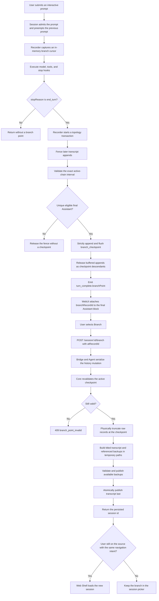

# Branching a Web Shell Session from a Completed Assistant Response

## Document Status

- Status: Implemented
- Date: 2026-07-30
- Scope: Web Shell, daemon session protocol, ACP bridge, session recording,
  transcript replay, and session persistence
- Review status: simplified after implementation review to remove branch-only
  claims/GC, full-history validation on every turn, unbounded client waits, and
  unused checkpoint correlation fields
- Simplicity stance: the feature needs the minimum sufficient invariants, not
  branch-specific recovery, job-ledger, or speculative schema subsystems
- Documentation stance: this document intentionally retains the architectural
  rationale, cross-layer flow, failure boundaries, and verification plan.
  Simplicity constrains the implementation; it does not remove context that
  reviewers and maintainers need to verify those invariants.

## 1. Summary

Web Shell currently branches only from the latest active session state. This
design lets a user branch from the final Assistant response of any successfully
completed interactive user turn recorded after this feature is introduced.

The design uses four rules:

1. A durable `branch_checkpoint` record is the only authority that a response
   is branchable.
2. The recorder creates that checkpoint in an exclusive topology transaction,
   so asynchronous metadata writers cannot create siblings or dangling
   parents.
3. The UI displays only checkpoints projected from the same frozen transcript
   snapshot as the corresponding Assistant response, and Core validates the
   checkpoint again when the user branches.
4. A fork is prepared outside the visible session namespace and becomes
   discoverable only after its transcript, title, available referenced
   file-history backups, and checkpoint topology are complete.

Branching truncates conversation history. It does not rewind or replace the
current working directory, Git state, or working files.

### 1.1 Simplicity boundary: no branch-specific overdesign

This feature intentionally uses the minimum machinery needed to preserve its
user-visible invariants. It does not need a dedicated subsystem for every
theoretical failure mode. Complete-before-visible publication, deterministic
transcript ordering, bounded UI waiting, and backward-compatible checkpoint
parsing are sufficient for the current product contract.

The implementation applies that boundary in four places:

| Concern                           | Minimum sufficient mechanism                                                                                                         | Why additional machinery is not needed                                                                                                                                                                                                                                                                 |
| --------------------------------- | ------------------------------------------------------------------------------------------------------------------------------------ | ------------------------------------------------------------------------------------------------------------------------------------------------------------------------------------------------------------------------------------------------------------------------------------------------------ |
| Branch publication                | Hidden operation-specific staging, publish backups first, and publish the complete transcript last                                   | A random server-generated session ID and transcript-last visibility already prevent a partial session from appearing. Claims, manifests, owner markers, and a branch-only garbage collector would add a second lifecycle without improving the visible atomicity guarantee.                            |
| Turn completion validation        | Initialize active-chain state once on restore, capture an in-memory cursor, and scan only records appended during the turn           | The recorder already owns append ordering through its coordinator and topology fence. Reloading and reconstructing the complete JSONL file after every `end_turn` repeats authoritative work and makes a long session cumulatively O(T²).                                                              |
| Request completion and navigation | Persist a historical branch, return its identity, load it separately, use a 120-second SDK bound, and reject stale navigation intent | Historical branching does not require a live restored session before it can acknowledge creation. The existing no-anchor v1 API still restores the new session before returning. A durable operation ledger, query API, cancellation protocol, and exactly-once delivery are not current requirements. |
| Checkpoint correlation            | Persist the checkpoint UUID, turn boundary, and Assistant UUID                                                                       | These fields fully authenticate the branch point. `promptId` had no checkpoint consumer, so retaining it would be speculative schema growth.                                                                                                                                                           |

The accepted trade-off is that a process crash before transcript publication
may leave a hidden temporary file or orphan backup directory, and a client may
lose an HTTP response for a branch that later becomes visible in the picker.
Neither case exposes a partial session or loses source-session data. Do not add
branch-specific recovery machinery unless production evidence shows material
storage accumulation, or the product explicitly requires queryable,
cancellable, or exactly-once branch operations.

## 2. Motivation

The existing path is:

```text
Web Shell
  -> WebUI session actions
  -> TypeScript SDK
  -> POST /session/:id/branch
  -> ACP session bridge
  -> qwen/control/session/branch
  -> SessionService.forkSession()
  -> return the persisted session id
  -> WebUI separately loads the new session
```

`SessionService` already stores records as a `uuid`/`parentUuid` tree and can
reconstruct history from an explicit leaf. Replay blocks also retain persisted
record identities. These are useful primitives, but an arbitrary Assistant
record is not automatically a safe branch point:

- an Assistant record can contain an intermediate tool call;
- a cancelled or token-limited turn may still contain visible Assistant text;
- cron, notification, title, telemetry, artifact, and file-history records can
  be appended around an interactive turn;
- a rewind can make a previously displayed record inactive;
- paged replay can place the Assistant and its later checkpoint on different
  pages;
- a process failure can otherwise expose a transcript before all referenced
  backups exist.

The feature therefore needs a durable completion boundary rather than a UI
heuristic such as "the latest visible Assistant message."

## 3. Goals

1. Show a Branch action on every eligible final Assistant response produced by
   a successful interactive user turn after rollout.
2. Create a new session whose active conversation ends at the selected turn.
3. Preserve the source session unchanged.
4. Keep the new session's working directory and files at their current state.
5. Preserve retained file-history snapshots so `/rewind` remains usable in the
   new session.
6. Make branch eligibility authoritative in Core and identical for recording,
   replay, and fork validation.
7. Serialize branch, rewind, prompt, continuation, and automatic transcript
   mutation so their ordering is deterministic.
8. Never expose a partially created session.
9. Keep the existing no-anchor branch behavior for branching from the latest
   state.

## 4. Non-goals

- Rewinding working files, Git state, or a worktree to the selected turn.
- Inferring branchability for legacy transcripts that lack durable terminal
  evidence.
- Branching from intermediate Assistant narration or tool-call messages.
- Providing exactly-once HTTP delivery. Once a complete session is published,
  it remains recoverable from the session picker even if the response socket
  fails.
- Changing the semantics of `/fork`, which launches a background agent and is
  separate from session branching.
- Selecting or recovering arbitrary sibling leaves from a multi-writer
  transcript. That is a separate topology-recovery concern.

## 5. Product Semantics

A response is branchable only when all of the following are true:

- it belongs to an interactive user prompt, not a cron or notification turn;
- the prompt completed with `stopReason === 'end_turn'`;
- it is the unique final visible, non-thought Assistant record in that turn;
- the Assistant record itself contains no `functionCall`;
- it occurs after the turn's final `tool_result`;
- every tool call in the turn is closed;
- a durable checkpoint was written successfully; and
- the checkpoint remains on the source session's current active chain when the
  branch request executes.

No checkpoint is created for cancelled, errored, partial, or `max_tokens`
turns. Legacy responses without a checkpoint do not display the action.

## 6. End-to-end Flow



## 7. Durable Branch Checkpoint

### 7.1 Record schema

Add `branch_checkpoint` to the `ChatRecord` system subtype union and add a
versioned payload:

```ts
export interface BranchCheckpointRecordPayloadV1 {
  v: 1;
  startExclusiveRecordUuid: string | null;
  assistantRecordUuid: string;
}
```

The stored record is:

```ts
const checkpoint: ChatRecord = {
  uuid: checkpointUuid,
  parentUuid: endInclusiveRecordUuid,
  sessionId,
  type: 'system',
  subtype: 'branch_checkpoint',
  timestamp,
  cwd,
  version,
  systemPayload: {
    v: 1,
    startExclusiveRecordUuid,
    assistantRecordUuid,
  },
};
```

Older v1 records may contain an extra `promptId`. Readers ignore that unknown
field, and new writers and forks do not persist it.

The checkpoint UUID is the API anchor and `assistantRecordUuid` is the replay
projection key; no branch resolver, fork builder, protocol adapter, or UI path
uses checkpoint `promptId`. Keeping an unconsumed field would create a false
compatibility obligation, so the schema deliberately omits it instead of
designing for a hypothetical future consumer.

The checkpoint record's own `uuid` is the branch leaf sent to the branch API.
Using the checkpoint rather than the Assistant UUID retains all required
records through the completed turn while excluding later records.

`startExclusiveRecordUuid` persists the exact boundary captured before the
turn. Core must not attempt to reconstruct this boundary by looking for the
nearest user record: retry and continuation paths do not always produce a new
ordinary user record, and automatic turns also use user-role records.

### 7.2 Shared eligibility helper and resolver

Keep the structural turn test in one internal pure Core implementation. The
recorder-facing entry accepts only the records appended since its captured
cursor plus the pending tool calls carried across that boundary:

```ts
resolveCompletedTurnBranchCandidateFromRecords(input: {
  records: readonly BranchPointRecord[];
  startExclusiveRecordUuid: string | null;
  pendingCallsAtStart: readonly BranchToolCallIdentity[];
}): BranchCandidate | undefined;
```

This is the hot-path incremental entry used before a checkpoint exists. The
persisted checkpoint resolver reuses the same internal range implementation
when it authenticates stored evidence:

```ts
resolveBranchPoints(
  activeChain: readonly ChatRecord[],
): ReadonlyMap<string, BranchPoint>;
```

The map is keyed by checkpoint UUID. Each `BranchPoint` contains the referenced
Assistant UUID and the exact validated turn interval.

For each checkpoint, the resolver verifies:

1. The payload version and identifiers are valid.
2. `startExclusiveRecordUuid` is `null` for an initial boundary or is a strict
   ancestor of `checkpoint.parentUuid` on the supplied active chain.
3. `assistantRecordUuid` lies inside
   `(startExclusiveRecordUuid, checkpoint.parentUuid]`.
4. The shared internal range resolver finds one eligible final Assistant in
   the interval according to the product semantics in section 5.
5. The eligible Assistant is exactly the Assistant referenced by the payload.

Malformed checkpoints are ignored during replay. A requested checkpoint that
is missing from the current catalog is rejected by the mutation path.

The recorder must use the incremental entry. The transcript reader and session
fork must use `resolveBranchPoints()`. Core does not expose a second full-chain
candidate wrapper solely for tests; both production entries share the same
private semantic engine. No layer may maintain a second approximation of
branchability.

## 8. Recorder Topology Transaction

### 8.1 Why a normal barrier is insufficient

`ChatRecordingService` currently has a serialized writer, but append admission
also advances the in-memory tail. Assistant recording can asynchronously start
auto-title generation, and title or other metadata can append after a flush
barrier. A separate "read tail, validate, append checkpoint" sequence can
therefore create siblings:

```text
end record
  +-- custom_title
  `-- branch_checkpoint
```

If the checkpoint becomes the physical leaf, reconstructing its chain drops the
other sibling. The checkpoint operation must reserve transcript topology, not
only wait for bytes to flush.

### 8.2 Central append coordinator

All transcript append paths must pass through one coordinator, including:

- user, Assistant, and tool-result records;
- strict and best-effort appends;
- auto and manual title records;
- telemetry and attribution records;
- artifact and file-history records; and
- future system metadata writers.

Add:

```ts
recordBranchCheckpointTransaction(input: {
  cursor: BranchCheckpointCursor;
  stopReason: string;
}): Promise<BranchPoint | undefined>;
```

For an `end_turn`, the method installs a synchronous topology fence before its
first `await`. Appends arriving while the fence is active are stored as ordered
intents; they do not advance `lastRecordUuid` or write to disk.

The transaction then:

1. waits for append work admitted before the fence;
2. verifies that the captured cursor still identifies the in-memory active
   chain boundary;
3. invokes the shared eligibility resolver only for records appended since
   that cursor, using the cursor's snapshot of pending tool calls;
4. strictly appends and flushes the checkpoint with the current tail as parent;
5. advances the tail only after the checkpoint is accepted by the writer; and
6. releases buffered intents in arrival order, assigning their parent UUIDs
   from the new live tail.

If the candidate is ineligible, no checkpoint is written and buffered intents
continue from the original tail. If validation or writing fails, `finally`
must safely release or fail buffered intents according to their existing
strict or best-effort contract. No child may reference a checkpoint that was
not durably written.

Checkpoint creation is an optional branching capability, not part of the
model turn's success contract. If the transaction rejects after the Assistant
response has completed, Session logs the recording failure and returns the
original successful turn without a branch point. The response must not be
retroactively converted into a turn error, and follow-up delivery and
automatic-queue drains must continue normally.

Auto-title generation may continue outside the fence. Its eventual append is
still ordered by the central coordinator.

### 8.3 Session timing

`Session.prompt()` captures `BranchCheckpointCursor` after admission and after
the previous prompt, cron turn, and notification turn have settled, but before
`#executePrompt()` writes anything for the new turn. The cursor contains the
active tail UUID, active-record count, and a copy of pending tool-call state.

After `#executePrompt()` and stop hooks finish, Session immediately awaits the
checkpoint transaction before starting cron or notification drains and before
emitting the completed branch point. The prompt holds the Agent history
mutation lock for this entire interval.

The recorder initializes its active-chain and pending-tool state once from the
restored session, then updates both through the existing append coordinator.
Ordinary appends are O(1); rewind truncates to the selected parent and rebuilds
pending-tool state for that exceptional topology change. Each completed turn
therefore scans only its newly appended records instead of rereading and
reconstructing the entire JSONL transcript.

This is not a weaker cache in front of a separate authority. The recorder is
the component that serializes and durably appends these records, and the
topology fence prevents later appends from entering the checkpoint interval.
Consequently, another full disk read inside every `end_turn` adds cost without
adding an independent consistency guarantee. A full reconstruction remains
appropriate once when restoring a session or after an exceptional rewind, not
on the normal turn-completion path.

## 9. Live Protocol

### 9.1 Agent response

When checkpoint creation succeeds, the Agent includes namespaced metadata:

```ts
{
  stopReason: 'end_turn',
  _meta: {
    'qwen.branchPoint': {
      assistantRecordUuid,
      checkpointUuid,
    },
  },
}
```

### 9.2 Bridge and SSE

The bridge validates both UUIDs and forwards the value only when the result is
an `end_turn`:

```ts
turn_complete.data.branchPoint = {
  assistantRecordUuid,
  checkpointUuid,
};
```

The typed daemon event, SSE ring replay, event compaction, and restored pending
prompt result must preserve this optional field. Unknown or malformed values
are dropped rather than repaired.

### 9.3 SDK and WebUI

Add an explicit optional `branchPoint` field to `DaemonTurnCompleteData` and
`PromptResult`. `matchTurnEvent()` must retain it. Normalized live events and
transcript blocks also retain the daemon-stamped `promptId`.

For an `end_turn`, the WebUI reducer requires the terminal event's `promptId`
to equal the active top-level Assistant block's `promptId`. It verifies that
the block is non-empty and is the final visible Assistant shape for that prompt,
then stores:

- `assistantRecordUuid` as its persisted record identity/source record; and
- `checkpointUuid` as `branchRecordId`.

If the active prompt or final block cannot be matched uniquely, the reducer
does not guess and the Branch action remains hidden. A transcript refresh can
later project the durable checkpoint.

## 10. Paged Transcript Replay

An Assistant record and its checkpoint can fall on different pages. Emitting a
metadata update only when the checkpoint is replayed is incorrect because each
page creates an independent `HistoryReplayer`, and backward pagination does not
retain pending state for the missing Assistant page.

Extend `SessionTranscriptReader` so branch-point discovery uses the same frozen
`TranscriptIndex` as the requested page:

- same file identity;
- same snapshot size;
- same selected leaf UUID; and
- same active-chain view.

During the index's single sequential snapshot parse, retain a compact resolver
projection containing only record identity/topology, checkpoint payloads,
tool-call identities, tool-response identities, and visible-Assistant markers.
After selecting the active chain, run the shared resolver once and freeze the
resulting catalog into `TranscriptIndex`. A page read may open only the records
needed for that page and must not reopen or materialize the entire active chain.

The reader returns only the `assistantUuid -> checkpointUuid` entries relevant
to Assistant records in that page. `HistoryReplayer` attaches
`branchRecordId` while projecting the Assistant record itself. Checkpoint
system records are not rendered as standalone blocks.

The catalog must not come from a separate `SessionService.loadSession()` read.
That would race with append or rewind and mix a frozen old page with the latest
active chain.

Old cursors continue to use their frozen transcript snapshot. A displayed old
checkpoint can still become inactive before the user clicks it; mutation-time
validation handles that case with a typed conflict.

## 11. API and UI

### 11.1 HTTP request

Extend the existing endpoint without replacing its latest-branch behavior:

```http
POST /session/:sessionId/branch
Content-Type: application/json

{
  "name": "Optional branch title",
  "atRecordId": "branch-checkpoint-uuid"
}
```

The TypeScript SDK surface becomes conceptually:

```ts
branchSession(name?: string): Promise<RestoredBranchResult>;
branchSession(name: string | undefined, atRecordId: string): Promise<PersistedBranchResult>;
```

`PersistedBranchResult` contains only `sessionId`, `displayName`, and
`forkedFrom`. Historical branch creation does not restore or attach the new
session in the daemon. This keeps historical persistence separate from
live-session admission; side-task creation and the existing no-anchor v1
branch operation, which promise an immediately usable live session, retain
their restore/attach paths.
The ACP-standard `session/fork` adapter uses the no-anchor v1 operation because
that protocol also promises an immediately owned live session.

If `atRecordId` is omitted, the endpoint retains the v1 latest-state contract:
it restores or attaches the new session and returns the complete restored
session response, including its client attachment. If it is present, Core
requires it to be a checkpoint in the source session's current active branch
catalog and returns the persisted branch identity for an explicit later load.

An invalid, inactive, malformed, or stale checkpoint returns:

```json
{
  "code": "branch_point_invalid",
  "error": "Invalid or inactive branch point: <recordId>",
  "errorKind": "branch_point_invalid"
}
```

with HTTP status `409`. There is no fallback to the current session tail.
Request-shape validation is distinct: a present but non-string `atRecordId`
returns the same `branch_point_invalid` code with HTTP status `400`. Stale-
checkpoint recovery keyed on the `409` status must not trigger for the `400`
type-level rejection.

### 11.2 UI behavior

Add optional `branchRecordId` metadata to the Assistant transcript/message
model. The Branch action is rendered only when this field exists and no turn is
currently active. Temporarily hiding the action while a later turn is running
prevents the request from waiting behind that turn longer than the client action
timeout and then committing a branch after the client has given up.

While a branch request is pending, disable the selected action. That row-local
state is presentation feedback, not the request-identity boundary: transcript
virtualization can unmount and remount the row while the request is still in
flight. `App` therefore also keeps one shared in-flight promise keyed by source
session, requested title, and checkpoint UUID. A remounted row joins the same
promise instead of issuing a second persistent mutation, and the entry is
removed in `finally`.

The SDK bounds the request to 120 seconds. On success, switch to the returned
session only if the user is still on the captured source session and no newer
session-load generation has started. A late result never supersedes newer
navigation; the persisted branch remains available in the session picker. On
`branch_point_invalid`, refresh the source transcript and explain that the
response is no longer on the active history path.

The 120-second bound prevents an indefinitely pending UI action; it is not an
exactly-once protocol. If the underlying non-cancellable ACP mutation commits
after the client stops waiting, the complete branch remains discoverable in
the picker and the navigation-generation check prevents a late automatic
switch. An operation-ID ledger would be justified only if the product later
requires explicit status lookup, cancellation, or idempotent retry.

Legacy Assistant responses and automatic turns have no field and therefore no
action.

## 12. History Mutation Serialization

Branch validation and fork creation must not race with rewind or another
prompt.

### 12.1 Bridge queue

Each live session owns a `promptQueue` FIFO promise chain (in
`packages/acp-bridge/src/bridge.ts`) covering:

- prompt and trusted continuation;
- branch;
- rewind; and
- close/drain coordination.

A branch request additionally rejects with `BranchWhilePromptActiveError` when
`pendingPromptCount > 0` or `promptActive` is true. Checking both values closes
the FIFO hand-off window in which an accepted prompt is pending but has not yet
set the active flag.

Closing first marks the session as closing, rejects new mutations, and drains
accepted work before teardown. Read-only attach and load operations do not join
the queue but must reject a session that is already closing where appropriate.

### 12.2 Agent lock

The Agent owns a non-reentrant `runExclusiveHistoryMutation` boundary covering
exclusive history mutations:

- branch read, validation, and creation;
- rewind; and
- cron and notification transcript writers.

Before an ordinary branch is queued behind that boundary, the Agent checks
`sourceSession.isIdle()` and returns `session_busy` immediately when an
interactive, cron, or notification turn is active. This is not a replacement
for the lock or the Session admission flag. It prevents a request from waiting
behind an automatic writer until the SDK's 120-second bound expires and then
committing later without a waiting UI.

Interactive prompts do not hold this lock for their complete lifetime. They
retain the Session's existing direct-preemption semantics: a newly admitted
prompt aborts and waits for the previous prompt. The checkpoint helper instead
uses the recorder's synchronous topology fence, which is the ownership boundary
needed for its append-and-flush transaction.

Before an Agent-locked branch performs any asynchronous work, it synchronously
acquires a Session history-mutation admission flag. Prompt admission checks the
flag both before and after writer admission and after live-tool synchronization.
Conversely, the flag can be acquired only while the Session has no active
prompt, cron, or notification turn. This closes the prompt-versus-branch race
without serializing overlapping interactive prompts behind the Agent lock.
Rewind rechecks idleness and performs its in-memory truncation synchronously,
then acquires the same flag before asynchronous file and artifact
reconciliation. Automatic writers continue to acquire the Agent lock
independently.

The Bridge queue provides request ordering and lifecycle coordination. The
Agent lock protects transcript ownership even for callers that bypass the HTTP
route. For a live recorded session, branch read, validation, and creation also
run inside the recorder's write barrier so the writer lease is asserted before
and after the filesystem transaction. The Agent lock is process-local and does
not replace this cross-process ownership check.

## 13. Historical Fork Construction

### 13.1 Source selection

Inside the Agent lock and Session history-mutation admission boundary, flush
the source recorder and read the source transcript. Resolve its current active
chain and validate `atRecordId` against the shared branch-point catalog.

Find the checkpoint at one unique physical index and first truncate the raw
record array:

```ts
const boundedRecords = records.slice(0, checkpointIndex + 1);
```

Only then reconstruct the checkpoint chain and call the side-artifact
selector. Passing the complete raw record array to the selector can otherwise
copy artifact records appended after the historical checkpoint.

### 13.2 Record rewrite

The target transcript:

- contains only the bounded active chain and eligible side artifacts;
- excludes inherited `parent_session` and `session_source` creation metadata;
- rewrites `sessionId` and `cwd` to the new top-level session;
- preserves origin through `forkedFrom`;
- remaps session-scoped artifact identifiers; and
- rebuilds a clean target parent chain.

When a retained checkpoint's `startExclusiveRecordUuid` points to a filtered
creation record, remap it to the nearest retained predecessor, falling back to
`null` only when no retained predecessor exists. Otherwise retain the UUID:
historical fork construction preserves source record UUIDs, so that retained
record is also the target predecessor representing the same exclusive turn
boundary.
Run `resolveBranchPoints()` on the completed target chain before publication so
earlier Assistant responses remain branchable from the new session.

### 13.3 File-history snapshots

Historical branch construction must not top up snapshots from the source
session's current full snapshot list. Only snapshot payloads retained before
the selected checkpoint belong in the target.

Collect the unique `trackedFileBackups[*].backupFileName` values referenced by
those retained snapshots. Do not derive backup names from `promptId` and do not
copy the complete source backup directory.

For each referenced name:

1. validate it as a filename, not an arbitrary path;
2. resolve source and destination paths and verify their directory boundary;
3. open the source without following symbolic links, verify that the opened
   handle and current path still identify the same regular file, and reject a
   changed or unsafe source;
4. asynchronously copy through that opened handle into an exclusively created
   staging file and flush the target; and
5. warn and omit a source that is already missing, but treat an access or copy
   failure for an existing regular backup as a fork failure.

Backup hard links are deliberately not used. Besides coupling the source and
target sessions to one inode, an `lstat`-then-`link` optimization leaves a
same-user race in which the source path can change before publication. Copying
from the verified open handle keeps ownership independent and avoids that
time-of-check/time-of-use gap.

The branch operation does not restore these backups into the working tree.
They exist only so a later explicit rewind in the new session remains valid.
An older source session may already have lost backups to retention cleanup;
that pre-existing degradation must not prevent ordinary or historical
branching, although the affected rewind snapshot remains unavailable.

## 14. Complete-before-visible Publication

### 14.1 Visibility rule

The session picker discovers a session from its published transcript. The
target `<newSessionId>.jsonl` must therefore be the last resource published.

Before creating target resources, compute and sanitize the final title. The
Core fork input includes that title, and Core appends its `custom_title` record
inside the staged transcript. There is no post-publication rename transaction.

### 14.2 Temporary resources

Branch session IDs are generated internally as random UUIDs. Before writing,
Core rejects an existing target transcript or backup directory. It then uses
operation-specific hidden temporary paths:

- the transcript temporary file sits directly in the chats directory; and
- the backup temporary directory sits beside the file-history destination.

The complete target transcript is written with exclusive creation and
restrictive permissions. There are no branch claims, manifests, owner markers,
or activity-triggered branch garbage collector.

The correctness requirement is that no incomplete transcript becomes visible,
not that every pre-commit crash artifact is synchronously reclaimed. Because
the temporary paths include both a random session ID and operation ID, ordinary
failure paths can clean them directly. Maintaining durable claims and a
periodic ownership-aware GC for rare process-crash leftovers would be
overdesign for this feature and would introduce more states and failure modes
than it removes.

### 14.3 Commit sequence

All filesystem operations in this sequence use asynchronous promise APIs so a
large transcript or backup set does not block the daemon event loop.

1. Write the complete titled transcript to staging.
2. Securely copy every available referenced backup to backup staging; warn and
   omit source backups that are already missing or no longer safe regular
   files.
3. Publish the complete backup directory.
4. Publish the transcript last. Prefer a hard link for no-overwrite semantics;
   if hard links are unavailable or disallowed, use same-directory rename so
   the complete file still becomes visible atomically.
5. Treat chats-directory `fsync` as best-effort after commit. A durability
   warning must not turn a successfully published branch into an API failure.

The transcript publication is the commit point. Before it, the session is not
discoverable. After it, the session is complete, titled, and owns every
available referenced backup copied during the operation.

### 14.4 Ownership after commit

Once the transcript is published, the branch endpoint returns its identity and
does not acquire Bridge live-session admission. Loading is a separate WebUI
action. A post-commit generation change does not delete or hide the branch.

## 15. Cleanup

The operation's `finally` block independently attempts to clean:

- transcript staging;
- backup staging;
- and a backup directory published before a failed transcript commit.

Cleanup failures do not replace the operation result and are logged with the
session ID. A process crash can leave an operation-specific hidden temporary
file or an orphan backup directory; the implementation accepts this rare
storage leak instead of maintaining a branch-only ownership and GC subsystem.
Normal session deletion remains responsible for committed session backups.

## 16. Failure Semantics

| Failure point                                         | Visible session? | Required result                                   |
| ----------------------------------------------------- | ---------------- | ------------------------------------------------- |
| Invalid or inactive checkpoint                        | No new session   | `409 branch_point_invalid`                        |
| Transcript hard link unsupported                      | Yes              | Fall back to same-directory atomic rename         |
| Title computation                                     | No               | Return error; create no target resources          |
| Staged transcript write                               | No               | Best-effort cleanup                               |
| Referenced backup missing, unsafe, or changed         | Yes, degraded    | Warn, omit backup, preserve branch                |
| Backup partially copied                               | No               | Fail and clean staging                            |
| Target checkpoint revalidation                        | No               | Fail and clean staging                            |
| Process exits before transcript commit                | No               | May leave hidden staging or an orphan backup      |
| Chats-directory `fsync` fails after transcript commit | Yes, complete    | Return success and log a durability warning       |
| User navigates elsewhere before branch result arrives | Yes, complete    | Preserve newer navigation; leave branch in picker |
| Separate WebUI load fails                             | Yes, complete    | Keep session in picker                            |
| HTTP response fails after commit                      | Yes, complete    | Never delete the persisted branch                 |

## 17. Implementation Map

| Area                                                              | Primary responsibility                                                                    |
| ----------------------------------------------------------------- | ----------------------------------------------------------------------------------------- |
| `packages/core/src/services/branch-points.ts`                     | Shared incremental and durable checkpoint semantics                                       |
| `packages/core/src/services/chatRecordingService.ts`              | Checkpoint schema, central append coordinator, topology transaction                       |
| `packages/core/src/services/sessionService.ts`                    | Shared resolver integration, bounded fork, backup whitelist, staging, commit, and cleanup |
| `packages/core/src/services/session-transcript-reader.ts`         | Same-snapshot branch-point catalog for paged replay                                       |
| `packages/cli/src/acp-integration/session/Session.ts`             | Prompt preemption, branch admission flag, turn capture, and checkpoint timing             |
| `packages/cli/src/acp-integration/session/history-replay-page.ts` | Attach branch metadata while projecting Assistant records                                 |
| `packages/cli/src/acp-integration/acpAgent.ts`                    | Idle fail-fast, exclusive-mutation lock, typed errors, and titled fork invocation         |
| `packages/acp-bridge/src/bridge.ts`                               | Persisted branch mutation; explicit restore/admission only for live side-task sessions    |
| `packages/cli/src/serve/routes/session.ts`                        | Optional `atRecordId`, validation, and minimal persisted-branch result                    |
| `packages/cli/src/serve/acp-http/dispatch.ts`                     | Compose ACP-standard fork with an explicit load and connection ownership                  |
| `packages/sdk-typescript`                                         | Branch request and live/replay metadata types                                             |
| `packages/webui/src/daemon/session`                               | Preserve metadata and expose the extended action                                          |
| `packages/web-shell/client`                                       | Branch action, request deduplication, and stale-navigation protection                     |

## 18. Verification Plan

### 18.1 Core resolver and recording

- Accept a normal text-only `end_turn`.
- Accept a final response after a closed tool loop.
- Reject an intermediate Assistant containing a function call.
- Reject cancelled, errored, partial, and `max_tokens` turns.
- Reject malformed, duplicate, non-ancestor, and inactive checkpoints.
- Cover retry and trusted continuation boundaries.
- Race auto title, manual title, telemetry, artifact, and file-history appends
  against the topology fence.
- Verify continuous parent chains for checkpoint success, ineligibility, and
  writer failure.
- Verify a rejected checkpoint transaction still returns the completed
  `end_turn` without branch metadata.
- Verify successive turns validate records from their captured in-memory
  cursors without reloading the transcript from disk.
- Verify legacy checkpoints containing `promptId` remain readable while newly
  written checkpoints omit it.

### 18.2 Replay and protocol

- Assistant and checkpoint on the same page.
- Assistant and checkpoint on different pages.
- Append after an old cursor is issued.
- Rewind after an old cursor is issued.
- SSE disconnect and ring replay retain `branchPoint`.
- Event compaction and prompt-result matching retain the field.
- A malformed live branch point is dropped.
- A prompt with no uniquely matching final block shows no action.

### 18.3 Mutation ordering

- Branch enters before rewind.
- Rewind enters before branch.
- Prompt or continuation enters around branch.
- A branch presented while an automatic turn is active fails with
  `session_busy` before waiting on the Agent mutation queue.
- A second direct prompt reaches Session admission immediately and preempts the
  first instead of waiting behind the Agent mutation queue.
- Branch admission wins atomically against a prompt waiting for writer or
  live-tool admission, and releases the flag on every success/failure path.
- Rewind holds the Session history-mutation flag through asynchronous file and
  artifact reconciliation.
- Close rejects new work and drains admitted work.
- Automatic turns cannot mutate the transcript inside an interactive prompt's
  checkpoint boundary.

### 18.4 Fork contents

- Branch from the first of three completed turns.
- Source session remains unchanged.
- Target session contains only the first turn and required side records.
- Artifact records after the checkpoint are excluded.
- Abandoned rewind branches are excluded.
- Retained checkpoints remain valid after creation-metadata filtering.
- Only referenced backup filenames are copied.
- Shared backup references are copied once.
- A backup already missing from the source is warned and omitted without
  blocking the branch.
- A symbolic link or a source replaced between path validation and open-handle
  verification is never published as a target backup.
- Access and partial-copy failures for existing backups leave no visible
  target session.
- Current working files remain unchanged.
- Rewind in the fork can consume retained backups.
- Fork publication does not call synchronous filesystem APIs.
- Unsupported or cross-device transcript hard links fall back to
  same-directory rename without creating branch claims or owner markers.

### 18.5 Publication and lifecycle injection

Terminate creation after:

- transcript staging;
- the first of multiple backup copies;
- complete backup staging;
- backup publication;
- transcript hard-link fallback; and
- transcript commit followed by chats-directory `fsync` failure.

Verify picker visibility, backup completeness, best-effort staging cleanup, and
commit-point behavior at every boundary. Also verify that ordinary branching
does not restore or consume live-session admission, side-task creation still
returns a loaded session, and a late branch result cannot override a newer
navigation intent. Unmount and remount the selected virtualized transcript row
while the request is in flight and verify that only one persistent branch
mutation is sent.

### 18.6 Web Shell E2E

1. Complete three interactive turns.
2. Confirm that each durable final Assistant response shows Branch.
3. Branch from the first response.
4. Confirm the old session still has all three turns.
5. Confirm the new session ends at the first turn.
6. Confirm the workspace files still have their latest contents.
7. Resume the new session and send another prompt.
8. Refresh history and confirm the same earlier branch points remain available.

## 19. Compatibility and Rollout

The request field, transcript block metadata, and event metadata are optional.
Calls that omit `atRecordId` retain the existing v1 restored-session response;
the persisted-only response applies only to the new historical overload. A
newer UI simply does not render historical Branch actions until it receives a
validated anchor.

Roll out in dependency order:

1. Core schema, resolver, recorder transaction, and persistence transaction.
2. Agent and Bridge locking plus optional protocol metadata.
3. SDK and WebUI metadata preservation.
4. Web Shell action and error UX.
5. Publication-failure and full Web Shell E2E coverage before enabling the UI
   by default.

No migration synthesizes checkpoints for legacy records. New successful turns
in an old resumed session become branchable as they receive new checkpoints.

## 20. Alternatives Rejected

### Use the Assistant UUID directly

Rejected because an Assistant record can be an intermediate tool-call message,
and its UUID does not prove a successful turn boundary.

### Infer final responses during replay

Rejected because legacy records do not persist enough terminal evidence to
distinguish every cancelled or partial response reliably.

### Attach checkpoint metadata when the checkpoint page is replayed

Rejected because the Assistant may be on another independently replayed page.

### Flush and append the checkpoint as two operations

Rejected because asynchronous title and metadata writers can append between
them and create sibling topology.

### Copy every source backup

Rejected because it leaks future history into a historical fork and makes a
partially copied target appear successful.

### Hard-link referenced backups

Rejected because it couples source and target retention to one inode and a
path-check-then-link sequence can publish a different file if the source path
changes concurrently. Copying from a verified open handle is small enough and
keeps session ownership independent.

### Publish the transcript before backups or title

Rejected because the session picker could discover an incomplete session.

### Delete a committed fork when load or HTTP delivery fails

Rejected because branch creation and loading are separate operations, and
another client may already have discovered the session. A committed fork is
retained and recoverable instead.
