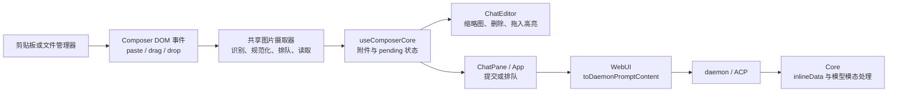
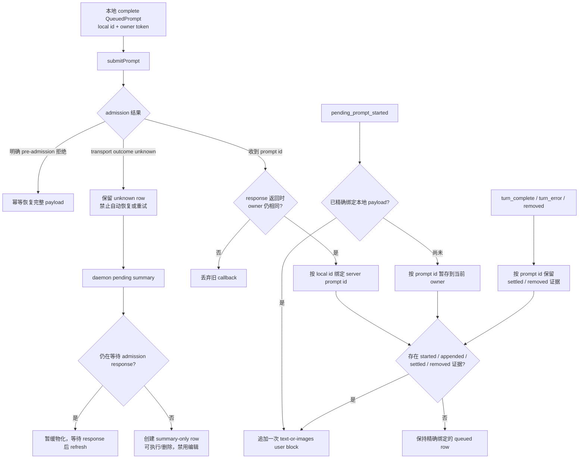
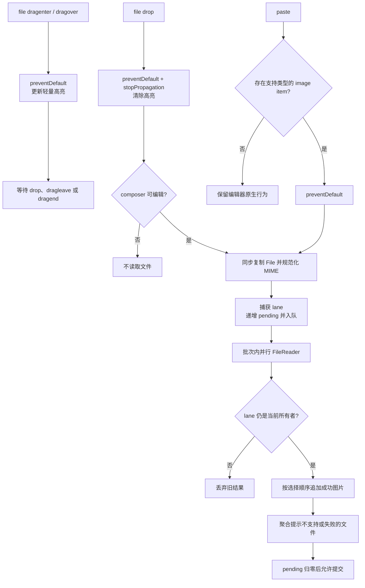

# Web Shell 图片拖放

## 状态

针对 [#8321](https://github.com/QwenLM/qwen-code/issues/8321) 的实现方案。初始实现由
`48d1e1d69` 落地，review 修正由 `afb55ebae` 补齐 admission、恢复和资源边界。
其中队列展示和 admission 失败语义已由
[Web Shell backend-authoritative queue display](../web-shell-backend-authoritative-queue-display.md)
取代；下文相关内容仅保留为历史记录。

该功能只补齐 Web Shell composer 的图片拖放入口，并复用现有图片粘贴、
附件预览、prompt 提交和多模态模型链路。daemon wire format、ACP、Core 和公开
Web Shell API 均不变；内部 WebUI action contract 增加 admission 边界和确认删除结果。

## 问题与现状

Web Shell 已经支持从剪贴板粘贴图片：`useComposerCore` 从
`DataTransferItemList` 读取 PNG、JPEG、GIF、WebP，转成 `PromptImage` 后由
`ChatEditor` 展示缩略图；提交时 WebUI 把图片转换成
`{ type: 'image', data, mimeType }`，再经 daemon 和 ACP 进入 Core 的
`inlineData`。图片字节到模型的链路已经存在。

当前缺口是 composer 没有接管浏览器文件拖放。把图片从文件管理器拖到
CodeMirror 或移动端 textarea 时，图片不会成为附件；浏览器的默认文件 drop
行为还可能插入无意义内容或离开当前页面。

现有粘贴实现还存在三个异步边界，新增拖放时需要一并收口：

- 多个 `FileReader` 按完成时间逐个追加，不能保证多图顺序；
- 图片读取完成前仍可能提交已有文字，导致本次图片漏发；
- session、workspace 或 composer 已清空后，晚到的 reader 仍可能把图片写入新状态。

此外，当前 `submitComposerText` 在文字和 tag 都为空时直接返回，没有把
`pastedImages` 纳入最终提交条件。因此已有缩略图并不等于可以发送 image-only
prompt；本方案把这一点作为拖放可用性的必要修复，而不是新增协议能力。

## 目标

- 从桌面文件管理器向 composer 拖放一张或多张图片，并沿用现有附件缩略图和删除交互。
- 桌面 CodeMirror 与触摸设备 textarea 使用同一个 drop 入口和同一条图片摄取链路。
- 粘贴和拖放统一支持 PNG、JPEG、GIF、WebP、BMP。
- 保证跨文件和跨批次的用户选择顺序。
- 图片读取期间不允许提交不完整的 prompt。
- 文字、tag 或图片任一存在时都可以提交，包括 image-only prompt。
- clear、session/workspace 切换和卸载后，旧异步任务不能污染当前 composer。
- 文件拖入 composer 时提供轻量、可访问且不影响布局的视觉反馈。
- 保持现有 public API、daemon wire format 和模型模态处理不变。

## 非目标

- 不增加文件选择按钮、上传接口或 daemon 端临时文件。
- 不支持 SVG、TIFF、HEIC、PDF、目录或远程 URL 拖放。
- 不改变模型是否支持图片输入的判断；拖放与现有粘贴遵循相同的模型行为。
- 不承诺从 daemon 的 text-only pending summary 跨页面重载恢复图片；summary-only prompt
  保持可执行/可删除，但不能编辑为一个缺少原附件的 payload。
- 不复制 daemon、代理或 Core 的 production 限制作为客户端 admission 策略。composer
  仅使用固定的并发和 encoded-data 预算保护浏览器资源；读取成功仍不代表 daemon 已接纳
  prompt，超出服务端请求上限时继续沿用既有发送失败与重试提示。
- 不让浏览器根据扩展名覆盖一个明确但不受支持的 MIME 类型。

## 架构与所有权



职责边界如下：

- `ChatEditor` 只拥有 composer surface 的 capture 事件接入和视觉状态展示，子级
  CodeMirror/textarea 不再拥有图片 paste/drop handler。
- `useComposerCore` 拥有图片批次、generation lane、同步 pending 门禁、附件状态和每批
  notice 发射，是摄取结果和提示语义的唯一提交者。
- 一个内部图片摄取 helper 只负责从浏览器传输对象提取 `File`、规范化类型并读取
  base64；它返回结构化结果，不读写 React 状态、不操作 queue，也不发 toast。
- WebUI、daemon、ACP 和 Core 继续使用现有 `PromptImage` 和 image content block，
  不感知图片来自 paste 还是 drop。

提示通过一条显式但仅内部使用的 callback 链进入现有 Web Shell toast owner：

```ts
type ImageIngestionNotice = (
  tone: 'warning' | 'error',
  message: string,
) => void;

onImageIngestionNotice?: ImageIngestionNotice;
```

该签名与现有 `pushToast(tone, message)` 的调用形态相同，不需要在中间层做对象到位置参数的
适配。`useComposerCore` 每批最多调用一次相应分类的 callback；`ChatEditor` 只透传。主 App
直接绑定 `pushToast`。split 链路通过 `SplitView` 传到 `ChatPane`；side-task 的真实
链路是 App → `ArtifactPanel` → `SideTaskPanel` → `ChatPane`，这些内部 props 都要求透传
同一 callback。App 的 drawer 与 docked 两个 `ArtifactPanel` 渲染点都必须传
`pushToast`。这样主聊天、split pane 和 side-task pane 都经过宿主的同一
ToastHost/`onToast` 转发策略，无新 context、无嵌套 ToastHost，也不增加公开
`WebShell` prop。缺少 callback 只允许出现在隔离单元测试，并降级为 console，不作为
生产 wiring。

## 图片识别与规范化

共享 helper 接收事件发生时的 `DataTransfer`，并同步复制 `File` 引用，避免异步阶段
继续访问已经失效的浏览器事件对象。

提取规则：

1. `files` 非空时以它为权威来源；否则遍历 `items` 中 `kind === 'file'` 且
   `getAsFile()` 成功的项目。两者不合并，避免同一文件被添加两次。
2. MIME 类型允许 `image/png`、`image/jpeg`、`image/gif`、`image/webp` 和
   `image/bmp`。
3. `image/x-bmp` 与 `image/x-ms-bmp` 规范化为 `image/bmp`。
4. 仅当 MIME 为空或为 `application/octet-stream` 时，才根据
   `.png`、`.jpg`、`.jpeg`、`.gif`、`.webp`、`.bmp` 推导规范 MIME。
5. 明确的非图片 MIME 即使扩展名看似图片也拒绝，避免把浏览器已经识别出的其他内容
   伪装成图片。

粘贴中只要存在受支持图片，或存在 MIME 受支持但 `getAsFile()` 失败的 image item，
就阻止本次原生 paste，与当前“图片优先”语义一致；只有文本或只有明确不支持的文件时，
不接管 paste。drop 只要包含文件载荷就必须被 composer 接管，即使最终没有受支持图片，
也要阻止浏览器默认导航，并给出一次聚合警告。

## 共享异步摄取

每次被接管的 paste/drop 形成一个不可变批次。helper 返回以下语义等价的结构，不直接
产生 UI 副作用：

```ts
interface ImageIngestionBatchResult {
  accepted: PromptImage[];
  rejected: Array<{
    name?: string;
    reason: 'unsupported' | 'unavailable' | 'too-large' | 'read-failed';
  }>;
}
```

`useComposerCore` 使用 generation-scoped promise queue 串行处理批次。每批先按 base64
encoded-data 估算筛选候选文件，再由最多四个 worker 并行读取，并在全部 reader settled
后一次性追加成功结果：

- helper 默认给单次调用 `8 * 1024 * 1024` bytes 的 base64 预算；`useComposerCore` 用该
  预算减去已有附件的 `data.length`，候选文件按 `ceil(file.size / 3) * 4` 预估，超过剩余
  预算的文件以 `too-large` 拒绝且不创建 `FileReader`；
- 同时活动的 `FileReader` 不超过四个，worker 把结果写回候选文件的原始索引，因此完成
  顺序不改变附件顺序；
- promise queue 保持批次到达顺序；
- 某个文件失败不阻止同批其他文件；
- `useComposerCore` 作为唯一提示所有者，把不支持、超预算和读取失败分别聚合为 warning、
  warning 和 error，每类每批最多一条 toast；
- queue 的 rejection 在内部消化，不能让一次失败阻断后续批次。

`imageIngestionLaneRef.current.pendingBatches` 是唯一同步权威，不再维护第二个 pending
ref。React `pendingImageBatchCount` state 只镜像当前 lane 的值以触发渲染：事件被接管时
先同步递增捕获 lane 的字段，若它仍是当前 lane 再写 state；批次结束时按同样的 owner
检查递减并镜像。reset 替换 lane 时同步把 state 置零。这样同一 render 间隔内立刻按
Enter 也会被 `submitComposerText` 的最终 ref 检查拒绝，同时按钮只消费渲染镜像。发送
按钮在 pending 期间禁用并显示现有 loading 图标，composer surface 设置
`aria-busy="true"`。批次完成后恢复普通提交，不自动发送。

按钮、Enter keymap、imperative `submit()` 和最终 `submitComposerText` 必须读取同一
不变量，不能分别推导：

```ts
hasSubmittableContent =
  trimmedText.length > 0 ||
  topTags.length > 0 ||
  inlineTags.length > 0 ||
  pastedImages.length > 0;

canSubmit = !disabled && pendingImageBatchCount === 0 && hasSubmittableContent;
```

最终 submit guard 使用同一个内容谓词，并在调用 consumer 前重新读取
`imageIngestionLaneRef.current.pendingBatches`，因此不能被尚未 render 的 state 镜像绕过。
它也必须包含 `pastedImages`，从而允许 image-only prompt。pending 或 consumer 同步拒绝
的提交保持文字、tag 和图片不变；consumer 一旦同步接受，则继续遵循各自已有的
optimistic/commit 语义，不在本功能中统一改写 prompt admission 生命周期。

该不变量必须沿调用链应用到所有消费者。尤其 `ChatPane.handleSubmit` 当前的
`if (!trimmed) return false` 改为只有 `!trimmed && !images?.length` 才拒绝；main App、
split pane 和 side-task pane 都必须允许空 text block 搭配非空 images。slash command
判断只在 text 非空时生效，不得把 image-only 误判成本地命令。

busy/queue 路径使用同一个条件。`useQueuedPrompts.enqueuePrompt` 当前的
`if (!trimmed) return true` 必须改为仅在 `!trimmed && !images?.length` 时返回；非空
images 加空 text 必须建立真实 `QueuedPrompt`。由于带图片的 prompt 按现有规则不走
mid-turn text insertion，它进入 ordinary pending submission，保留图片副本并在 session
转 idle 后按现有流程发送。enqueue 返回成功前，队列对象必须已经可观察，不能把空文字
image-only 当成已消费的 no-op。

### Queued prompt 完整性与所有权

队列的关联、编辑、清理和明确 admission 拒绝后的恢复也必须按完整 prompt payload 处理，不能
继续把“文字是否发生变化”当成“图片是否已经恢复”的替代信号。以下保证明确限定在同一
mounted composer owner 内：daemon 的 `DaemonPendingPromptSummary` 不含图片，页面重载或
只有服务端 summary 时无法从现有协议重建附件，设计不得声称可以跨重载恢复原图。

`QueuedPrompt` 复用本地创建后不变的递增 `id` 作为恢复 key，并增加内部字段
`payloadCompleteness: 'complete' | 'summary-only'`。本地 prompt 始终是 `complete`；只从
daemon summary 物化的 row 是 `summary-only`，因为即使它有非空 text 也无法判断原 prompt
是否还带图片。summary-only row 可以继续执行或删除，但禁用 edit/restore-to-editor，UI
给出“重新载入后附件不可用于编辑”的明确说明，不能静默恢复残缺 payload。若未来要求
跨重载完整编辑，必须让 pending API 返回 canonical content；这属于单独的协议变更。

本地 image prompt 的 `submitPrompt` 请求以 captured local id 和 queued-prompt owner token
建立关联；成功收到 admission response 和 `promptId` 时按 local id 精确绑定并删除同 id
的临时 summary row。对 `payloadCompleteness === 'complete'` 的 row，后续 refresh 只更新
server id/state，绝不让 daemon 的展示摘要覆盖原始 text、images 或 annotations；ACP 对
image-only 生成的 `[image]` 只用于 summary-only row 展示，不能进入 canonical payload。
`syncServerQueuedPrompts` 不再按 text 匹配任何带图片的 submitting row；只要同一 owner
仍有未决、可能对应某个 summary 的本地 image submission，就暂缓物化无法精确归属的
server row，待请求收到明确结果后立即 refresh。这样多个 canonical text 都为 `''`、
summary text 都为 `[image]` 的并发 image-only prompt 不会因文本碰撞错误绑定。成功响应
可以消除对应的临时重复 row；没有本地关联的 server row 才以 summary-only 物化。

admission error 必须保守分类：只有能够证明请求在 daemon `sendPrompt` 之前被拒绝的响应
（例如 JSON body parser 的结构化 `413`）才是 `definitely-rejected`，可以移除本地 row 并
恢复 payload。网络断开、timeout、client abort、response parse 失败以及无法证明边界的
5xx 都是 `outcome-unknown`：daemon 可能已经接纳 prompt，只是 202 response 丢失。此时
保留 complete row 并标记 `admissionOutcome: 'unknown'`，停止自动发送、恢复和 retry，触发
refresh 并显示“提交结果未知，请先检查 transcript/queue”的持久提示。用户只能显式丢弃
本地副本，或在确认“可能重复执行”的警告后把副本恢复到 editor；恢复只复制、不自动发送。
unknown row 不再阻塞 server summary 物化；无法关联的 summary-only row 与本地 unknown
row 分组显示“二者可能对应”，但绝不自动合并或声称去重，因为现有协议没有证明关系。
queue clear 遇到已经 dispatch 且尚无 `promptId` 的 row 也采用同一 unknown 状态，不能以
abort 成功推断 daemon 未接纳。彻底自动消除该不确定性需要 client-generated idempotency/
correlation id，属于本功能禁止的协议变更。

同一 mounted owner 内的恢复 helper 接收有序 `QueuedPrompt[]`，并遵循以下原子语义：

1. 先校验 captured owner token、payload 是 complete 且 editor handle 存在；不满足时不
   修改状态、也不记录 key；
2. 过滤已经恢复的 key；把非空文字按 queue order 连接为一个 block，再只调用一次
   `mergeRestoredPromptText(current, block)`，没有非空文字时跳过文字 merge；
3. 图片按同一 queue order 展平；`inputAnnotations` 按合并后文字位置平移，再通过 editor
   handle 恢复。已有 annotation 在新 block 前插时同步平移，普通编辑发生在范围之前时映射
   offset，编辑与范围重叠时删除 annotation，避免提交 stale metadata；
4. 文字、图片和 annotations 都同步写入成功后才记录对应 key，再恢复焦点；同一 owner 内
   重复的 abort catch 或 refresh callback 因相同 key 成为 no-op；
5. 批量恢复只适用于明确拒绝或已确认从 server 删除的 complete prompt；一次完成上述
   合并，保证 `[A, B]` 得到 `A\nB` 和 `[A-images, B-images]`，不能逐项正序调用前插 helper。

`popQueuedPromptForEdit` 相应改为返回 `QueuedPrompt | null`，调用方只判断 `null`，不能用
空字符串的 truthiness 判断是否找到了 prompt。这样本地 image-only queued prompt 在
安全恢复路径中不会丢图，也不会因为同一恢复路径执行两次而复制附件；outcome-unknown
明确不进入该 helper。

queued-prompt 生命周期另设对象身份的 `QueuedPromptOwner`，在 session、workspace 或
composer owner 每次变化时同步替换；即使 session id 从 S1 切到 S2 再回到 S1，对象也不
复用。submit、remove、refresh 和 pending-event handler 都在启动时捕获 token，并在修改
queue、恢复 editor、append transcript、发错误提示前检查引用相等。已恢复 `id` 集合属于
该 token 并随新 owner 新建，而不是清空后继续只靠 session id 比较，从而关闭 ABA 窗口。

`pending_prompt_started` 也必须保留 image-only 的本地 transcript 语义。找到精确 local
prompt 后，append guard 使用 `text.length > 0 || prompt.images?.length > 0`，继续传
`toStoreImages` 并以 `displayedServerPromptIdsRef` 去重。若 started event 早于 admission
response，先按 `promptId` 缓存在 captured owner；response 精确绑定 local id 后再追加，
不能用空 text 猜测多个 image prompt 的归属。main、split 和 side-task 因而都会即时显示
一次含图 user block。

response 前的生命周期证据在 `QueuedPromptOwner` 内按 prompt id 保存，并限制为最多 200
项。一个 attempt 进入 outcome unknown 不得清除其他 attempt 的 started 证据；refresh 也
不能因为 terminal 已让 prompt 离开 pending list，就过早删除仍在等待 response 精确绑定的
证据。实现分别保留 started、已经 append、settled 和 removed 状态：

- started/terminal 都早于 response 时，response 绑定 local payload 后只 append 一次；文本
  prompt 即使 started 时已经 append，也不会在 terminal 或 response 后重复追加；
- queued prompt 被删除时，bridge 会发送 `pending_prompt_completed{removed}`，随后发送
  `turn_complete{stopReason:'cancelled'}`。若没有 started 证据，该 prompt 从未 dispatch，
  response 到达后直接移除本地 row，不追加 user block；
- started 后被取消仍保留已执行过的本地 user block；turn error 和普通 completion 在 response
  到达后按 exact prompt id flush；
- exact response 消费对应证据，owner 替换清空 owner 状态，超过容量时按插入顺序淘汰。



`onSessionChange` 的 public payload 不增加图片字段，`prompt` 仍是原始字符串；但 main
App 的 direct submit、`onSubmitBefore` queued submit 和普通 queued submit 三处事件门禁
都必须从 `text.trim()` 改为 `text.trim() || images?.length`。因此 image-only admission
会发出 `{ type: 'submit', prompt: '', queued: ... }`，使宿主收到真实 session activity，
而不是伪造占位文字或悄悄漏掉事件；direct 路径仍按现有逻辑安排 session-list reload。

main App 的 post-admission turn-error retry 同样采用 text-or-images 内容谓词：retry hint 和
`handleRetry` 都在 `lastSubmittedPromptRef` 非空或 `lastSubmittedImagesRef` 非空时允许重试，
并继续以 `optimisticUserMessage: false` 重发保存的原 MIME/base64 和 input annotations。
owner 变化时完整 last-submitted payload 与 retryable error 一起失效，避免把旧 session
payload 重发到新 session。
这与前述 pre-admission `413` failed-prompt retry 是两条不同路径，两者都要覆盖。
上述 definite/unknown 分类同样约束 main App 与 `ChatPane` 的 admission catch：只有明确
pre-admission 拒绝才进入 failed-prompt retry；transport outcome unknown 时 optimistic
message 标成未知、不可一键重试，并等待 transcript/queue 刷新。post-turn retry 若在
`onAdmitted` 前丢失 response，也建立保存完整 payload 的相同 unknown 状态；`turn_error`
已经证明 admission 成功，所以 `onAdmitted` 之后的 reject 只按 turn error 处理。

两个 direct consumer 与 queue 共用一个仅内部的 definitely-rejected/outcome-unknown
分类 helper，但各自保存 owner-scoped 状态，不增加 transcript store 或公开 Web Shell API。
当前 definitely-rejected allowlist 只有结构化 `413` 和 endpoint 不支持的 `501`；
`400`、`408`、`429`、`499`、5xx 和 transport/parse error 都按 unknown 处理。

WebUI action 在本地 active-prompt guard 和 payload 组装完成后、调用 daemon
`submitPrompt` 前触发内部 `onAdmissionStarted`。consumer 只有收到该边界后才把非明确拒绝
视为 outcome unknown；本地 guard rejection 仍是普通错误。action 收到 admission 后先触发
`onAdmitted`，随后 turn completion 的 reject 不得回退为 admission unknown：

- attempt 捕获 owner token、session id、完整 payload、composer commit callback；App 继续
  用发送前后 transcript snapshot 得到 optimistic user `messageId`；
- App 把 `{ sessionId, messageId, outcome: 'unknown' }` 保存为独立于 `FailedPrompt` 的本地
  状态，并在 composer 上方显示持久警告，只提供“丢弃本地副本”和经过重复执行确认的
  “恢复副本”，绝不复用 `sendFailed` 的 retry 按钮；
- `ChatPane` 保存相同 attempt；如果无法取得 message id，则在 pane 内显示同等警告。进入
  unknown 后 composer（包括按钮、Enter、imperative submit、编辑和附件删除）进入只读
  锁定，不能靠保留下来的 payload 直接再次发送；“丢弃本地副本”调用 captured commit 后
  解锁，“继续编辑”先显示可能重复执行的确认，确认后只解锁、既不 commit 也不发送；
- owner 替换清除 UI 投影并使旧 action/callback 失效。明确 `413` 不进入 unknown 锁：App
  继续现有 failed-prompt 语义，`ChatPane` 保留可编辑 composer；已收到 `onAdmitted` 的
  turn error 也不进入该锁。

unknown marker 与可恢复 payload 分开保存：“丢弃/恢复本地副本”只清理 payload 和解除
composer 锁，composer 上方仍保留“结果未知”警告；只有后续 transcript/queue 证据能够
确认结果，或 owner 被替换时，才清除 marker。

因此 outcome-unknown 的状态 owner、UI 投影和解除动作均有单一来源；仅设置一条
toast 或只禁用 failed-message retry 都不满足安全门禁。

side-task 的自动命名定义为“第一个 admission 成功的非空文本 prompt”，而不是“第一个
user block”。`ChatPane` 只有在 `trimmed.length > 0` 时才设置
`firstPromptAdmittedRef` 并调用 `onFirstPromptAdmitted`。`SideTaskPanel` 用已完整载入的
transcript 中 `block.kind === 'user' && block.text.trim().length > 0` 判断是否已经存在可命名
prompt；仅有 image-only user block 的新建或恢复 session 仍保留命名资格。这样首次
image-only admission 不会用空标题消耗资格，随后第一条非空文字仍只触发一次既有 rename
重试流程。direct、ordinary queued 和 mid-turn insertion 都在各自精确 admission 成功时调用
同一个 once-only callback。

### Generation 与清理

单独的 generation 数字不足以隔离 queue tail、pending 和活动 reader。实现使用一个
lane 对象作为所有权令牌：

```ts
interface ImageIngestionLane {
  generation: number;
  tail: Promise<void>;
  pendingBatches: number;
  activeReaders: Set<FileReader>;
}
```

每个批次在入队时捕获 lane 对象；读取结果、toast、pending 镜像和 `finally` 只有在
`imageIngestionLaneRef.current === capturedLane` 时才能提交。`activeReaders` 只拥有尚未
settle 的 reader；每个 reader promise 的 `load`、`error` 和 `abort` 路径通过一次性
settle helper 保证恰好结束一次。该 helper 在所有终态的第一步都从 captured lane 删除
reader，再 resolve/reject 并释放对 data URL 结果的额外引用；正常完成的 reader 不能
一直保留到下一次 reset。

以下操作同步创建一个带全新 resolved `tail`、零 pending 和空 active-reader set 的 lane，
替换 ref 后再 abort 旧 lane 的活动 `FileReader`：

- 清空 composer 文本和图片；
- session 或 workspace 所有者变化；
- hook 卸载。

新 generation 的批次进入新 tail，不等待旧 tail。尚未开始的旧批次出队时直接结束；
已 abort 的 reader 必须 settled，但因为 lane 已变化，不更新附件、pending 镜像或
toast。旧批次的 `finally` 也不能递减新 lane 的 pending。每批任务无论 helper 成功或
抛错，都会在 tail 上转成已处理的 fulfilled 结果，保证同 lane 后续任务继续执行。

删除单张已经完成读取的附件不会推进 generation，也不会取消同一 composer 中仍在
读取的其他批次。提交路径在 pending 为零时才可进入，因此提交成功后的现有清空逻辑
不需要处理活动 reader。



## Composer 事件与拖放交互

图片 `paste` 和文件 drag/drop 都挂在带 `data-web-shell-composer-surface` 的 composer
根容器 React capture handlers 上，而不是 `editorArea`，也不分别实现 CodeMirror 和
textarea 两套逻辑。该根容器同时包住 attachment/tag、输入区和 toolbar，所以 drop 在
composer 任意可见区域都不会落到浏览器默认文件导航。capture 阶段先于 CodeMirror 的
默认处理。实现时删除 CodeMirror `domEventHandlers.paste` 和 mobile backend `onPaste`
的图片摄取职责，避免同一事件被添加两次；纯文本仍自然落入子编辑器的默认处理。

| 事件           | 文件载荷                   | 处理                                                                |
| -------------- | -------------------------- | ------------------------------------------------------------------- |
| `paste`        | 至少一个可接管 image item  | `preventDefault()`，形成一个图片批次                                |
| `paste`        | 只有文本或明确不支持的文件 | 不拦截，保留原生 paste                                              |
| `dragenter`    | 任意 file payload          | `preventDefault()`；可编辑时进入高亮态                              |
| `dragover`     | 任意 file payload          | `preventDefault()` 并设置 `dropEffect = 'copy'`                     |
| `drop`         | 任意 file payload          | `preventDefault()`、`stopPropagation()`、清除高亮；可编辑时形成批次 |
| 任意 drag/drop | 只有文本或 URL             | 不拦截，保留 CodeMirror/textarea 默认行为                           |

file payload 通过 `dataTransfer.types` 中的 `Files` 或可见 file item 识别。disabled
composer 仍独占并阻止任意文件 drop 以防页面导航，但不读取文件、不发错误 toast，也不
显示激活态。

仅在 composer 可编辑时设置 `data-image-drag-active`；CSS 使用现有主题 border 和
background token 做轻量高亮，不新增 overlay、不改变尺寸，也不添加动画。

高亮状态使用 composer 根容器内部 drag depth，并辅以 `relatedTarget` containment，
避免指针在缩略图、tag、CodeMirror 和 toolbar 子节点间移动时闪烁。以下路径无条件把
depth 和 active state
归零：surface `drop`、全局 `dragend`、window `blur`、composer disabled/reset、
generation lane 替换和组件卸载。全局监听器只在 active 期间安装，并在清理时移除。

成功接管 drop 后保持当前输入内容，并把焦点还给当前输入后端。轻量高亮是辅助反馈；
最终成功状态仍以现有附件缩略图为准。键盘和触摸用户继续使用 paste，因此不新增只能
通过拖放访问的能力。

## 失败与兼容性

| 场景                         | 行为                                                            |
| ---------------------------- | --------------------------------------------------------------- |
| 不支持的 drop 文件           | 阻止浏览器默认导航，不添加附件，聚合 warning                    |
| 混合支持/不支持文件          | 按原顺序添加支持的图片，并聚合提示跳过数量                      |
| `getAsFile()` 返回 `null`    | 记为 unavailable；同批其他文件继续                              |
| `FileReader` error/空结果    | 不添加该文件；当前 lane 下聚合 read-failed error                |
| 超过客户端 encoded-data 预算 | 不创建 reader；跳过该文件并聚合 too-large warning               |
| generation reset 触发 abort  | 静默 settle，不更新旧 lane 的附件、pending 或 toast             |
| 图片仍在读取时提交           | 同步拒绝提交，保持文字和附件，等待后由用户再次发送              |
| 读取中切换 session/workspace | abort 并丢弃旧 generation，不提示新会话                         |
| 模型不支持图片               | 沿用 Core 的现有模态降级/错误语义                               |
| 请求体过大                   | 沿用现有 failed-prompt 与 retry，不在 composer 复制 daemon 限制 |

helper 只返回结构化 accepted/rejected；toast 只能由当前 lane 的 `useComposerCore`
产生。混合成功与失败时先追加成功图片，再按 unsupported/unavailable/read-failed 分类
聚合计数。用户 clear、owner 切换或 unmount 引起的 abort 静默，不属于读取失败。

### 既有大小边界

这里存在三个独立且计量对象不同的边界：

- Web Shell 在每次 paste/drop ingestion 中以 `8 MiB` base64 data 预算减去当前已有附件，
  限制本批可读候选，属于固定的浏览器资源保护，不是 daemon admission 阈值；
- `qwen serve` 的 `express.json({ limit: '10mb' })` 限制整个已经 base64 编码并包含 JSON
  envelope 的 HTTP 请求体；超过后在路由前返回结构化 `413`。
- Core 的 `DEFAULT_MAX_INLINE_MEDIA_BYTES = 10 * 1024 * 1024` 限制单个
  `inlineData` 的估算 decoded bytes，只有请求先通过 daemon parser 后才生效，且可由
  daemon 环境配置覆盖。

base64 通常比原始文件大约增加三分之一，因此不存在“某个固定大小的原图一定可通过 Web
Shell 发送”的契约。composer 的 `8 MiB` 是独立的客户端资源预算，不复制可能被 daemon
配置或部署代理改变的阈值，也不把本地读取成功显示成 admission 成功。HTTP `413` 走现有
prompt send-failure 路径。主 App 的 active-session 路径保持现有 optimistic clear：失败的
user message
保存原始文字和图片副本并提供同 payload retry，但原 composer 不承诺原位保留或编辑；
用户需要重新创建较小的 prompt。`ChatPane` 继续只在 `onAdmitted` 后调用 composer
commit，因此该消费端在 pre-admission `413` 时保留原 composer。两条路径都必须按各自
既有契约测试，不能用其中一条替另一条作全局声明。

既有限制的边界测试按各自真实计量对象断言：daemon 测试构造序列化后
`Buffer.byteLength(body)` 分别为 `10 MiB - 1`、`10 MiB`、`10 MiB + 1` 的 JSON body，
前两者进入路由、后者返回 `413`；Core 测试构造估算 decoded bytes 为
`limit - 1`、`limit`、`limit + 1` 的 base64，前两者保留 `inlineData`、后者替换为
oversized placeholder。它们验证既有服务端契约；Web Shell helper 测试单独验证四路并发、
候选顺序和 encoded-data 剩余预算。

BMP 以 `image/bmp` 进入缩略图 data URL 和 daemon image block。Core 的
`SUPPORTED_IMAGE_MIME_TYPES` 明确包含 `image/bmp`，`ImageTokenizer` 解析 BMP 尺寸，
OpenAI converter 把启用 image modality 的 `inlineData` 原样构造成
`data:image/bmp;base64,...`；Gemini 路径保留相同 `inlineData`。因此 V1 不在浏览器转码。
浏览器若不能解码缩略图，不影响附件数据传输，但 E2E 必须覆盖 Chromium 解码，
Firefox/Linux 必须完成人工验收。

提交后的 user transcript 还经过 `isSafeImageSrc`，因此其被动位图 data-URI allowlist 必须
加入精确的 `image/bmp;base64,`，否则 composer 预览可见而 user message 会静默隐藏 BMP。
只扩展这一种 base64 raster MIME；SVG、任意 `data:` 和其他主动内容继续被拒绝。
`UserMessage` 使用同一安全 helper，不另开绕过白名单的 BMP 渲染分支。

保证范围只到 Web Shell → daemon → ACP → Core canonical `inlineData`，以及当前
OpenAI/Gemini 的图片路径。Anthropic converter 的既有 allowlist 仅包含 JPEG、PNG、
GIF、WebP，BMP 会被明确转换为 `Unsupported inline media type: image/bmp` 文本，而不是
作为图片发给服务端；本功能保留并测试这一既有 provider 降级。若产品未来要求 BMP 在
所有 image-capable provider 上保持图片语义，需要单独设计 Core/provider 转码，不能在
Web Shell 输入层静默改变格式。

该变更不需要 feature flag：旧 daemon 已能接收同一 image block，新 Web Shell 只是增加
一种本地输入来源。宿主公开的 `WebShell` props、`PromptImage` 结构和能力协商均不变。

## 测试方案

### Helper 单元测试

- `files` 权威来源与 `items` 回退不会重复文件。
- 五种规范 MIME、BMP 两种别名、空 MIME/`application/octet-stream` 扩展名回退。
- 明确的非图片 MIME、SVG、TIFF、目录和 `getAsFile() === null`。
- 多文件读取乱序完成、部分失败和空 reader 结果仍输出有序成功项和正确计数。
- 同时活动的 reader 不超过四个；超过 encoded-data 剩余预算的文件不创建 reader，并返回
  `too-large`。
- `load`、`error`、`abort` 竞态只 settle 一次；helper 只返回结构化结果且从不发 toast。

### Hook 与 DOM 测试

- composer 根 surface 的 capture handler 接管 PNG/BMP 单图和多图 drop，设置
  `dropEffect=copy`，并阻止默认文件行为；子 CodeMirror handler 不再摄取图片。
- 文本/URL drop 不被接管；不支持文件 drop 被拦截且仅由 composer core 产生一条聚合
  提示。
- 图片 paste 同样只经过外层 capture handler；纯文本 paste 落入 CodeMirror 或
  textarea 原生路径，移动 backend 不保留第二套图片 handler。
- dragenter、子节点穿越、离开 surface、drop、dragend、window blur、disabled/reset 和
  unmount 的激活态转换。
- 在 editor、已有缩略图、tag 和 toolbar 上分别 drop 支持/不支持文件；全部只摄取一次，
  disabled 状态全部阻止默认文件行为且不摄取。
- 两个批次以事件顺序追加；同批 reader 乱序完成不改变文件顺序。
- 当前 lane 的唯一 pending 字段在 React 更新前即可阻止 Enter、imperative submit 和最终
  submit guard，state 镜像驱动按钮；reset 与 stale `finally` 不会造成两者分叉，完成后
  不会自动提交。
- 只有图片时，按钮和 Enter 均可提交；`ChatPane` 的空文本 guard 接受非空 images，
  split pane 和 side-task pane 至少各有一个消费端回归测试。
- main App、split pane、side-task pane 在 responding/busy 状态提交 image-only 时都会
  创建带原始图片的 `QueuedPrompt`，随后走 ordinary submit；`useQueuedPrompts` hook 测试
  断言它不是成功 no-op，也不进入 mid-turn text lane。
- 同一 mounted owner 内，image-only queued prompt 在明确 admission 拒绝或确认删除后的
  edit/restore 中恢复原始图片恰好一次；文字为空或已经位于 editor 顶部时也不抑制首次
  图片恢复。批量恢复 `[A, B]` 具体断言文字为 `A\nB`、图片为
  `[A-images, B-images]`，annotations 按文字 offset 合并；范围前编辑会平移 annotation，
  范围内编辑会删除它。owner 不匹配或 editor 尚未就绪时不写入、也不提前消费恢复 id，
  `popQueuedPromptForEdit` 不把空 text 当成未找到。
- 模拟 daemon 已接纳但 202 response 丢失：queued、main App 和 `ChatPane` 都标记
  outcome unknown，不自动恢复/重试、不生成第二次请求。App 显示独立的持久 unknown
  警告而不显示 retry；`ChatPane` 的按钮、Enter、imperative submit、编辑和附件删除
  全部锁定。显式“恢复副本”或“继续编辑”需要重复执行确认且绝不自动发送。明确 `413`
  则仍走 definitely-rejected 路径且 `ChatPane` 不锁定；clear 一个已 dispatch 且没有
  prompt id 的 row 也不得把 abort 当成明确拒绝。
- 多个并发 image-only submission 遇到 refresh/start-event/response 乱序时只能按 local id
  与返回的 server prompt id 精确绑定，不按空 text 或 `[image]` 匹配；收到成功 response
  的请求不产生重复 row，started event 最终只追加一次包含原图的本地 user block，
  main/split/side-task 都覆盖。outcome unknown 则保留独立、带歧义说明的 local/server rows，
  不做未经证明的合并。
- complete image-only row 绑定后再 refresh/started/edit/retry，canonical text 始终是 `''`；
  daemon 的 `[image]` 只能成为 summary-only 展示文案，不能覆盖本地 payload。
- started、terminal 和 response 的乱序同时覆盖 image-only 与 text prompt：已执行 prompt
  恰好 append 一次。真实 `pending_prompt_completed{removed}` → cancelled terminal 且没有
  started 的 queued prompt 不 append；started 后取消仍保留已经显示的 user block。
- 一个 attempt outcome unknown 不清除另一个 attempt 的 started 证据；exact response、owner
  替换和超过 200 项分别消费、清空或淘汰关联状态。
- action 的 `onAdmissionStarted` 只在本地 guard 通过后触发；`onAdmitted` 后的 turn error 不
  建立 unknown。clear abort 后若 server removal 确认成功，返回 `removedAfterAbort` 并删除
  local row；remove 失败或结果不明确才保留 unknown。
- reload 后只有 daemon summary 的 prompt 标为 summary-only：仍可执行或删除，但 edit 被
  禁用并显示附件无法恢复的说明；不得承诺或测试跨重载恢复原图。非空 text 加图片的
  summary 同样不能被误当成完整 payload。
- queued-prompt owner 的 S1 → S2 → S1 ABA 测试让旧 submit/remove/refresh/started callback
  在返回后无法修改新 queue、editor、transcript 或 toast；新 owner 的合法 callback 正常
  工作。
- main App 的 direct、`onSubmitBefore` queued 和普通 queued 三条 image-only 路径都发出
  一次 `onSessionChange` submit event，断言 `prompt === ''`、`queued` 标记正确且 direct
  路径仍触发延迟 session-list reload；真正无文字且无图片时不发事件。
- main App 的 image-only turn_error 会显示 retry hint，按钮和 Ctrl+Y 都用保存的原
  MIME/base64 重发且 `optimisticUserMessage: false`，不追加重复 optimistic message；
  session/owner 切换后旧 payload 不可重试。
- side-task 先 admission image-only、再 admission 非空文字时，只用后者命名一次；新建与
  已恢复的 image-only-only transcript 都保留资格，已有非空 user text 的 transcript
  不重新命名，rename 失败继续走既有重试语义。
- clear、session/workspace 切换和 unmount 会立即建立新 lane 并 abort 旧 reader；新
  batch 不等待旧 tail，旧结果、旧 toast、旧 pending 和旧 `finally` 都不能修改新 lane。
- 单批 helper 抛错后同 lane 的下一批仍执行；load、error、abort 和部分失败批次的
  `activeReaders` 都在 settle 后归零，不能持有已经完成的 data URL。
- paste 回归覆盖纯文本放行、混合文本/图片的图片优先语义，以及 PNG/JPEG/GIF/WebP
  原行为；新增 BMP paste 覆盖。
- `isSafeImageSrc` 只新增允许 `data:image/bmp;base64,`，`UserMessage` 与 direct/queued
  transcript 均渲染 BMP；SVG 和其他 data URI 继续被拒绝。
- 图片删除、附件状态通知、prompt queue 和 retry 继续携带规范化 MIME。
- 主 App、split pane 和 side-task pane 分别验证 warning/error callback 到现有 toast
  owner；side-task 测试覆盖 drawer、docked App → ArtifactPanel → SideTaskPanel 透传，
  stale lane 和 lifecycle abort 不调用 callback。

### 浏览器 E2E

在现有 Web Shell mock daemon smoke 测试中构造真实 `DataTransfer`：

1. 在页面上下文中用真实 PNG/BMP bytes 创建两个 `File`，加入一个 `DataTransfer`；
2. 向 `[data-web-shell-composer-surface]` 依次派发可取消、冒泡的
   `dragenter`、`dragover`、`drop`，完整经过 React capture 路径；
3. 验证拖放高亮清理、两个缩略图可解码且顺序一致；
4. 不输入文字，直接发送 image-only prompt；
5. 通过现有 mock daemon 的 request recorder 断言最终 prompt body 依次包含 text、
   `image/png`、`image/bmp`，并核对 base64 内容而不只核对数量；提交后的 user transcript
   也显示两张可解码图片，证明 BMP 没有被安全白名单隐藏；
6. 覆盖删除一张图片后只发送剩余附件，以及纯文本 drop 仍进入编辑器；
7. 让 mock daemon 对 main App active-session 的带图片 prompt 返回 `413`，验证原
   composer 按既有 optimistic 语义清空，failed user message 保留原始文字、MIME、
   base64 和 retry，且 retry 不创建重复 optimistic message；另在 `ChatPane` 测试中验证
   pre-admission `413` 不调用 commit、原 composer 保留；
8. 让 prompt admission 成功后产生 `turn_error`，验证 image-only retry hint 可见，触发
   retry 后 request recorder 收到相同 MIME/base64，transcript 不增加第二条 optimistic
   user message。

BMP 的下游回归不只停在 mock HTTP 入参：在既有 ACP session prompt 转换测试中加入
`image/bmp`，验证最终 Core canonical content 保持
`inlineData.mimeType === 'image/bmp'`；OpenAI/Gemini converter/tokenizer 聚焦测试验证
各自既有图片路径，Anthropic 聚焦测试明确断言 BMP 转为 unsupported-media 文本。daemon
已有结构化 `413` 测试，Core 已有 inline-media within/over limit 测试；本功能不复制
production 限制，只确认 Web Shell 对这些既有失败语义的状态保留。

Playwright CI 当前只安装 Chromium，因此 issue 中报告的 Linux Firefox 场景采用明确的
人工验收：从文件管理器拖入 PNG、BMP、多图、混合非法文件，并验证页面不跳转、顺序、
预览、删除和发送。后续若仓库统一增加 Firefox browser matrix，再把该用例加入自动化，
本功能不单独扩大整个 Web Shell CI 浏览器安装范围。

### 验证命令

实现阶段从 `packages/web-shell` 运行定向 Vitest、`npm run typecheck`、`npm run lint`、
`npm run build` 和 `npm run test:e2e:smoke`。设计文档本身使用 Prettier check 和
`git diff --check` 验证格式。

`afb55ebae` 的 review 修正验证包括 Web Shell 7 个聚焦文件 530 tests、WebUI 2 个聚焦文件
237 tests、两包 lint、相关文件 Prettier、全仓 `npm run build && npm run typecheck` 和
`git diff --check`。该修正没有改变浏览器 drag/drop DOM 路径，因此没有重复运行原功能的
browser smoke。

## 验收标准

- PNG、JPEG、GIF、WebP、BMP 可通过 paste 或文件 drop 成为同一种 composer 附件。
- image-only、文字加图片和 tag 加图片共用同一 `canSubmit` 不变量。
- main App、split pane 和 side-task pane 都接受 image-only，并保持各自既有 admission
  commit 语义。
- busy 状态的 image-only 一定生成并发送真实 queued prompt，不会因空文本静默丢图。
- 同一 mounted owner 内，image-only queued prompt 在明确拒绝或确认删除后的安全恢复
  保留原图且恰好一次；批量恢复保持 prompt 顺序，owner token 阻止包括 S1 → S2 → S1
  在内的旧 callback 污染。
- admission outcome unknown 不自动恢复或重试；它保留完整本地副本并明确提示可能已经执行，
  只有用户确认风险后才能恢复一个不自动发送的副本。
- 并发 image prompt 不按 text 关联 server row，started event 只产生一条含图 user block；
  reload 后的 summary-only row 不伪装成可恢复的完整 payload，继续执行/删除与禁用编辑的
  边界明确，`[image]` summary 不覆盖 complete row 的 canonical 空 text。
- direct 与两条 queued admission 都为 image-only 发出内容准确的 session-change 事件；
  side-task 的首次自动命名资格留给第一条 admission 成功的非空文本。
- image-only 的 post-admission turn error 可以重试原图片且不复制 optimistic user message。
- 多图、多批次、部分失败时，成功附件始终保持用户选择顺序。
- 图片读取最多使用四个并发 reader；paste/drop ingestion 按已有附件计算剩余预算，不接纳
  会使估算 base64 data 超过 `8 MiB` 的新候选。该预算不宣称等于 daemon admission 限制。
- 图片读取期间无法发送不完整 prompt；读取完成后用户可以正常发送或删除附件。
- 当前 ingestion lane 的 `pendingBatches` 是唯一同步提交门禁，渲染 state 只做镜像。
- 清空、切换 owner 或卸载后没有跨 composer 的晚到附件或提示。
- 新 generation 的 batch 不被旧 queue tail 阻塞，任何 reader 终态都能可靠 settle 并从
  `activeReaders` 释放。
- 文件拖入有轻量高亮，composer 的 attachment、editor、tag、toolbar 任一位置 drop 都
  不会触发浏览器导航，文本 drop 语义不变。
- 每个生产 composer 的 ingestion notice 都进入现有 ToastHost/宿主 `onToast`；drawer
  与 docked side-task 的 ArtifactPanel hop 均有覆盖，生命周期 abort 静默。
- BMP 在 composer、user transcript、Core canonical content、OpenAI/Gemini 图片路径和
  Anthropic 文本降级上的语义都有明确测试，不承诺跨 provider 一致图片语义。
- daemon wire format、ACP、Core 和公开 Web Shell API 没有协议或类型变更；内部 WebUI
  action contract 增加 `onAdmissionStarted` 和 `removedAfterAbort`。
