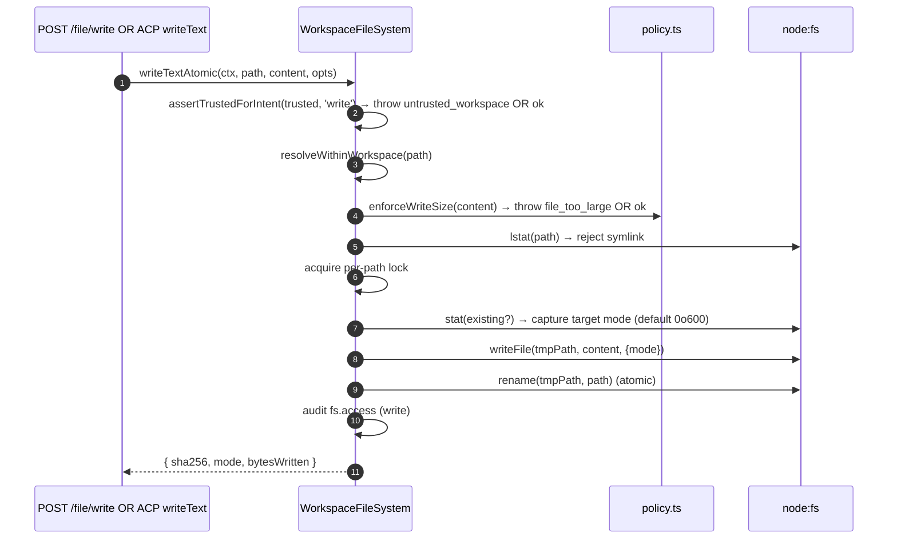
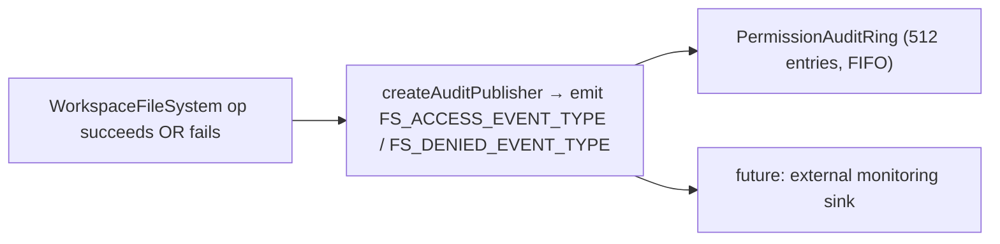

# Workspace File System Boundary

## Overview

Daemon HTTP file routes and ordinary delegated ACP `readTextFile` / `writeTextFile` calls go through the `WorkspaceFileSystem` boundary (`packages/cli/src/serve/fs/`), which provides:

- **Path resolution** — canonicalize paths and reject anything escaping the bound workspace, including via symlinks.
- **Trust gating** — refuse writes when the workspace is not trusted (`untrusted_workspace`).
- **Size & content policy** — full-snapshot/output cap (`MAX_READ_BYTES = 256 KiB`), large-text windows bounded in both output and scan cost (`MAX_TEXT_SCAN_BYTES = 8 MiB`), write cap (`MAX_WRITE_BYTES = 5 MiB`), binary detection.
- **Atomicity** — write-then-rename with target mode preservation; new files default to `0o600`, or follow the process umask under the factory's `system` new-file mode policy (`QWEN_SERVE_NEW_FILE_MODE`).
- **Audit** — every access / denial emits a structured event for `PermissionAuditRing` / monitoring.
- **Typed errors** — closed `FsErrorKind` union mapped to HTTP statuses.

The HTTP file routes (`GET /file`, `GET /file/bytes`, `POST /file/write`, `POST /file/edit`, `GET /list`, `GET /glob`, `GET /stat`) use this boundary and never receive the same-host exception. In the production daemon, ACP calls that remain delegated reach the injected bridge adapter; generic bridge callers use WFS only when they inject such an adapter. Production same-host `qwen serve` runtimes advertise `readTextFile: false`, so all child `FileSystemService.readTextFile` consumers use the regular CLI filesystem service. Final ACP `writeTextFile` content writes remain delegated: workspace targets use WFS, while a strict built-in-tool marker may select an equivalent host writer for an external path only on daemon-created same-host adapters. See [the external write design](../../design/daemon-external-tool-text-writes.md).

That text-read capability slice covers direct `read_file` plus the shared pre-reads used by write, edit, notebook, sed, and artifact operations:

- It intentionally accepts regular CLI read behavior rather than the WFS read-side guarantees. [The design doc](../../design/daemon-local-text-reads.md) owns the exact list of what is given up.
- The same doc records the bounded sense in which the retained adapter read path "fails closed"; the separate external-write design records how the approved final-write failure is closed.
- Direct external `read_file` keeps the normal CLI permission rules and core file-operation telemetry.
- HTTP filesystem routes remain workspace-scoped, and agent discovery-tool behavior is unchanged by this capability.
- Auxiliary actions such as parent-directory creation and arbitrary shell commands are separate existing paths, not covered by this boundary.
- `qwen serve` assumes a same-machine, same-UID security principal and is not an OS sandbox.

## Responsibilities

- Resolve user-supplied paths into branded `ResolvedPath` values that the rest of the boundary can safely use.
- Refuse paths outside the bound workspace (`path_outside_workspace`) and paths whose target is a symlink (`symlink_escape`).
- Refuse full-snapshot reads above `MAX_READ_BYTES`, while allowing explicit windows with output capped at `MAX_READ_BYTES` and scan cost capped at `MAX_TEXT_SCAN_BYTES`; refuse writes above `MAX_WRITE_BYTES` and binary files (`binary_file`).
- Refuse writes/edits when the workspace is untrusted (`untrusted_workspace`) — gated by `assertTrustedForIntent(trusted, intent)`.
- Honor `.gitignore` / `.qwenignore` patterns via `shouldIgnore`.
- Perform atomic write-then-rename with target mode preservation; new files default to `0o600` (umask-derived `0o666 & ~umask` under the `system` new-file mode policy).
- Emit `fs.access` / `fs.denied` audit events on every operation.
- Map every failure to a `FsError` with kind and HTTP status; route handlers serialize them uniformly.

## Architecture

### Module layout

| File                       | Purpose                                                                                                                                                                                                                                               |
| -------------------------- | ----------------------------------------------------------------------------------------------------------------------------------------------------------------------------------------------------------------------------------------------------- |
| `paths.ts`                 | `canonicalizeWorkspace`, `resolveWithinWorkspace`, `hasSuspiciousPathPattern`, branded `ResolvedPath`, `Intent` union (`read \| write \| list \| stat \| glob`).                                                                                      |
| `policy.ts`                | `MAX_READ_BYTES`, `MAX_TEXT_SCAN_BYTES`, `MAX_WRITE_BYTES`, `MAX_UPLOAD_BYTES`, `BINARY_PROBE_BYTES`, `assertTrustedForIntent`, `detectBinary`, `enforceReadBytesSize`, `enforceReadSize`, `enforceWriteSize`, `shouldIgnore`.                        |
| `audit.ts`                 | `FS_ACCESS_EVENT_TYPE`, `FS_DENIED_EVENT_TYPE`, `createAuditPublisher`, audit payload types.                                                                                                                                                          |
| `errors.ts`                | `FsError` class, `isFsError`, `FsErrorKind` union (14 kinds), `FsErrorStatus` union (`400 / 403 / 404 / 409 / 413 / 422 / 500 / 503`).                                                                                                                |
| `workspace-file-system.ts` | `createWorkspaceFileSystemFactory`, `WorkspaceFileSystem` (the orchestrator that reads/writes/lists), `WriteMode`, `ContentHash`, `FsEntry`, `FsStat`, `ListOptions`, `GlobOptions`, `ReadTextOptions`, `ReadBytesOptions`, `WriteTextAtomicOptions`. |

### `FsErrorKind` taxonomy

| Kind                     | Default HTTP | Meaning                                                                                                                                                                                       |
| ------------------------ | ------------ | --------------------------------------------------------------------------------------------------------------------------------------------------------------------------------------------- |
| `path_outside_workspace` | 400          | Resolved path is outside the bound workspace.                                                                                                                                                 |
| `symlink_escape`         | 400          | Target is a symlink (rejected per the conservative PR 18 + PR 20 posture).                                                                                                                    |
| `path_not_found`         | 404          | `ENOENT`.                                                                                                                                                                                     |
| `binary_file`            | 422          | Content sniffed binary on a text route, or large text in an encoding the text route cannot decode.                                                                                            |
| `file_too_large`         | 413          | Windowless/full-snapshot text above `MAX_READ_BYTES`, a line offset beyond `MAX_TEXT_SCAN_BYTES`, or a write above `MAX_WRITE_BYTES`.                                                         |
| `hash_mismatch`          | 409          | Optimistic-concurrency `expectedSha256` failed, or the file changed during a stable read.                                                                                                     |
| `file_already_exists`    | 409          | `mode: 'create'` against an existing file.                                                                                                                                                    |
| `text_not_found`         | 422          | `POST /file/edit`'s search string wasn't in the file.                                                                                                                                         |
| `ambiguous_text_match`   | 422          | Multiple matches when exactly one was required.                                                                                                                                               |
| `untrusted_workspace`    | 403          | Write attempted in an untrusted workspace.                                                                                                                                                    |
| `permission_denied`      | 403          | OS-level `EACCES` / `EPERM`.                                                                                                                                                                  |
| `io_error`               | 503          | `ENOSPC` / `EIO` / `EBUSY` / `ETXTBSY` / `ENAMETOOLONG` / `EMFILE` / `ENFILE`. **Distinct from `permission_denied`** so monitoring pipelines do not page security responders for "disk full". |
| `internal_error`         | 500          | Non-errno error that reaches the boundary (`TypeError`, programmer bug).                                                                                                                      |
| `parse_error`            | 400 / 422    | Request-body parse error (400) or service-level invariant breach (422).                                                                                                                       |

### `BridgeFileSystem` (the ACP-side adapter)

`packages/acp-bridge/src/bridgeFileSystem.ts` defines:

```ts
interface BridgeFileSystem {
  readText(params: ReadTextFileRequest): Promise<ReadTextFileResponse>;
  writeText(params: WriteTextFileRequest): Promise<WriteTextFileResponse>;
}
```

This is the injection point for ACP `readTextFile` / `writeTextFile`. Bridge tests and Mode A embedded callers can omit it on `BridgeOptions`; `BridgeClient` falls back to its inline `fs.readFile` / `fs.writeFile` proxy (preserves pre-F1 behavior). Production `qwen serve` wires `BridgeFileSystem` through `createBridgeFileSystemAdapter(fsFactory)` (`packages/cli/src/serve/bridge-file-system-adapter.ts`) and sets `delegateReadTextFileToClient: false`. Capability-compliant children therefore read text locally and delegate final ACP text writes. The adapter retains its read implementation so unexpected or capability-violating delegated reads still encounter WFS's workspace boundary. Its external host-writer path is disabled by default and selected only by exact versioned provenance on daemon-owned same-host adapters; injected bridges, workspace registries and factories, generic ACP, and HTTP retain the ordinary boundary.

Two defensive properties the adapter MUST preserve (because the inline proxy is fully bypassed when the adapter is injected):

1. **Reject non-regular files** — sockets / pipes / char devices / procfs / sysfs entries can stream unbounded data despite `stats.size === 0`. The inline path throws with `describeStatKind(stats)` in the message.
2. **Avoid unbounded full-file buffering.** The inline fallback caps a buffered read at `READ_FILE_SIZE_CAP = 100 MiB`. The injected adapter instead applies the stricter WorkspaceFileSystem contract: full snapshots stop at 256 KiB, while larger UTF-8 files require a finite `limit` and are streamed from an inode-bound handle with at most 256 KiB returned. It must not read an entire 500 MB log merely to return `{ line: 1, limit: 10 }`.

The adapter goes further: it uses `WorkspaceFileSystem.writeTextOverwrite` (PR 18 primitive) for workspace writes and a factory-owned equivalent for strictly marked external built-in-tool writes. Both use atomic temporary-file-and-rename writes with mode preservation, new-file mode under the factory's `NewFileModePolicy` (`0o600` default; umask-following under `system`), and symlink rejection inside the shared canonical-path lock. This is a **divergence from the pre-F1 inline proxy** which resolved symlinks and wrote through to their target — agents that relied on writing through symlinked dotfiles now have to address the resolved path directly.

### FsError preservation over the ACP wire

When the `BridgeFileSystem` adapter throws an `FsError` (`kind: 'untrusted_workspace'` / `'symlink_escape'` / `'file_too_large'` / etc.), the ACP SDK's default RPC error path serializes only `error.message` as a generic `-32603 "Internal error"` — `kind` / `status` / `hint` are stripped. The downstream agent RPC client would then have to regex-match the human-readable message to dispatch typed UI (auth retry vs file picker vs proxy hint).

`BridgeClient.writeTextFile` and `BridgeClient.readTextFile` install a thin guard (`packages/acp-bridge/src/bridgeClient.ts`) that catches FsError-shaped throws and rethrows them as ACP `RequestError`:

```ts
function isFsErrorShape(err: unknown): err is FsErrorShape {
  return (
    err instanceof Error &&
    err.name === 'FsError' &&
    typeof (err as { kind?: unknown }).kind === 'string'
  );
}

function preserveFsErrorOverAcp(err: unknown): never {
  if (isFsErrorShape(err)) {
    throw new RequestError(-32603, err.message, {
      errorKind: err.kind,
      ...(err.hint !== undefined ? { hint: err.hint } : {}),
      ...(err.status !== undefined ? { status: err.status } : {}),
    });
  }
  throw err;
}
```

The agent's RPC client now receives `data.errorKind` (the closed `FsErrorKind` value) plus the optional `data.hint` and `data.status`, so SDK consumers branch on the typed enum instead of regex-matching the message.

Two design notes:

- **Duck typing over import** — `FsError` lives in `packages/cli/src/serve/fs/errors.ts` while `BridgeClient` lives in `packages/acp-bridge`. A direct `import { FsError }` would invert the dependency. The duck check (`name === 'FsError'` + `kind: string`) mirrors what `mapDomainErrorToErrorKind` (`status.ts`) already does for `TrustGateError` / `SkillError` for the same cross-package bundling reason.
- **JSON-RPC code stays at -32603** — the bridge cannot reliably map `FsError.kind` to a JSON-RPC error code shape, so the structured `data` field carries the semantic information for SDK consumers. The wire status code (`-32603` "internal error") is unchanged; clients route on `data.errorKind`.

### Trust gate

`assertTrustedForIntent(trusted, intent)` consumes the trust boolean injected by
the caller; the policy layer does not read `Config.isTrustedFolder()` directly.
Read / list / stat / glob are always allowed (trust is only for writes). Write
intents in untrusted workspaces throw
`FsError('untrusted_workspace', ..., status: 403)`. The trust signal flows in
via `WorkspaceFileSystemFactoryDeps.trusted: boolean` — `runQwenServe` passes
`true` because the operator booted the daemon against a workspace they
implicitly trust; `createServeApp` (direct embed without `runQwenServe`)
defaults to `false` and warns once per process (see
[`02-serve-runtime.md`](./02-serve-runtime.md)).

## Workflow

### Read

```mermaid
sequenceDiagram
    autonumber
    participant R as HTTP route OR BridgeFileSystem.readText
    participant FS as WorkspaceFileSystem
    participant POL as policy.ts
    participant FSP as node:fs

    R->>FS: readText(ctx, path, opts)
    FS->>FS: resolveWithinWorkspace(path) → ResolvedPath OR throw
    FS->>FSP: stat(path)
    FSP-->>FS: stats
    FS->>FS: reject if not regular file (describeStatKind)
    alt cursor supplied
        FS->>FSP: open stable FileHandle
        FS->>FS: validate cursor {dev,ino,size}; seek to the byte offset
        FS->>FS: return whole lines; emit the next cursor
    else file <= 256 KiB
        FS->>FSP: open + read stable full snapshot
        FSP-->>FS: buffer
        FS->>FS: hash full snapshot; apply line/output limits
    else file > 256 KiB AND an explicit window arg
        FS->>FSP: open stable FileHandle
        FS->>FS: stream requested lines from the same inode
        FS->>FS: cap output at 256 KiB and scan at 8 MiB; omit full-file hash
    else windowless large read
        FS-->>R: file_too_large
    end
    FS->>POL: detectBinary(sample)
    POL-->>FS: isBinary?
    FS->>FS: reject if binary
    FS->>FS: shouldIgnore? → annotate meta.matchedIgnore
    FS->>FS: audit fs.access
    FS-->>R: { content, optional sha256, truncated?, meta }
```

`readText` does not skip or reject reads because of ignore rules. It reads the
file normally and records the matching ignore classification in
`meta.matchedIgnore`. `list` and `glob` filter ignored results only when
`includeIgnored` is not enabled.

### Write



The atomic write-then-rename ensures a SIGKILL / OOM mid-write does NOT leave the target truncated. `mode: 'create'` aborts with `file_already_exists` on lstat; `mode: 'overwrite'` proceeds; `expectedSha256` arms optimistic-concurrency (`hash_mismatch` on mismatch).

### `POST /file/edit` (single text replacement)

Adds two failure modes on top of write:

- `text_not_found` (422) — search string not in the file.
- `ambiguous_text_match` (422) — multiple matches when exactly one was required (the route's contract).

### Audit fan-out



`FS_ACCESS_EVENT_TYPE` / `FS_DENIED_EVENT_TYPE` carry context (`ctx`), path, intent, outcome, errorKind?, bytesRead/written, sha256?.

## State & Lifecycle

- The factory is built once at daemon boot (`runQwenServe` → `resolveBridgeFsFactory` → adapter).
- Each request constructs a `RequestContext` and invokes the factory's orchestrator for that call only — no long-lived per-file state.
- Per-path locks live only for the duration of the write operation (no cross-call locking; concurrent writes to the same path race on the lock and serialize).
- Audit ring is owned by `runQwenServe` and shared with the permission audit publisher.

## Dependencies

- `@qwen-code/qwen-code-core` — `Ignore`, `isBinaryFile`, `Config.isTrustedFolder()`.
- `node:fs`, `node:path`, `node:crypto`.
- `@qwen-code/acp-bridge` — `BridgeFileSystem` contract on the ACP side.
- HTTP routes: `packages/cli/src/serve/routes/workspace-file-read.ts`, `workspace-file-write.ts`.

## Configuration

| Source                                            | Knob                                                                                           | Effect                                                                                                            |
| ------------------------------------------------- | ---------------------------------------------------------------------------------------------- | ----------------------------------------------------------------------------------------------------------------- |
| `WorkspaceFileSystemFactoryDeps.trusted: boolean` | Constructor input                                                                              | Whether writes are allowed; defaults to `true` from `runQwenServe`, `false` from `createServeApp` (with warning). |
| Constant                                          | `MAX_READ_BYTES = 256 KiB`                                                                     | Full-snapshot and returned-text cap; larger text requires an explicit window argument.                            |
| Constant                                          | `MAX_TEXT_SCAN_BYTES = 8 MiB`                                                                  | Bytes a large-text read may scan to locate a line offset; past it, `file_too_large`.                              |
| Constant                                          | `MAX_WRITE_BYTES = 5 MiB`                                                                      | Write cap; sized below `express.json({ limit: '10mb' })`.                                                         |
| Constant                                          | `MAX_UPLOAD_BYTES = 50 MiB`                                                                    | Binary upload cap for `POST /file/upload`; uploads never overwrite and auto-number occupied names.                |
| Constant                                          | `BINARY_PROBE_BYTES = 4096`                                                                    | Sample size for content-based binary detection.                                                                   |
| Capability tags                                   | `workspace_file_read`, `workspace_file_bytes`, `workspace_file_write`, `workspace_file_upload` | See [`11-capabilities-versioning.md`](./11-capabilities-versioning.md).                                           |
| Workspace files                                   | `.gitignore`, `.qwenignore`                                                                    | Ignored paths surface as `ignored: true` from `shouldIgnore`.                                                     |

## Caveats & Known Limits

- **Symlinks are rejected, not followed.** This is a divergence from the pre-F1 inline `BridgeClient.writeTextFile` proxy which resolved symlinks. Agents writing through symlinked dotfiles need to address the resolved path directly.
- **`io_error` vs `permission_denied` are distinct.** Do not conflate them. Monitoring pipelines key on `errorKind` for alerting — folding ENOSPC into permission_denied would page security responders for `df -h` problems.
- **New file mode defaults to `0o600`, not umask defaults.** The write syscall's `mode` arg bypasses umask. Agents cannot pass a per-write mode override. Operators who want agent-created files to follow the daemon's umask can opt in per daemon with `QWEN_SERVE_NEW_FILE_MODE=system` (existing files still preserve their mode); see [`17-configuration.md`](./17-configuration.md).
- **`createServeApp` default `trusted: false`** silently rejects ACP writes with `untrusted_workspace` for embedders that do not inject a custom `fsFactory` or `bridge`. A one-time stderr warning fires the first time; further callers see no reminder. See [`02-serve-runtime.md`](./02-serve-runtime.md).
- **Large text requires an explicit window argument**, any of `line` / `limit` / `maxBytes`. A read with none of them stays `file_too_large`, because a caller that believes it holds the whole file may write it back truncated. Windows stream from an inode-bound handle and never return more than `MAX_READ_BYTES`.
- **`MAX_READ_BYTES` caps what a read returns; `MAX_TEXT_SCAN_BYTES` caps what it costs.** Line offsets are resolved by scanning from byte 0, so `{ line: 900_000_000, limit: 20 }` returns almost nothing and still walks the file. Past 8 MiB of scanning the read is refused with `file_too_large` pointing at `readBytes`, which reaches any offset in O(1).
- **Streamed windows tolerate appends, not truncation.** The full-snapshot path can demand byte-for-byte stability because it returns the whole file; a prefix window cannot, or every read of a live log fails. The streamed path asserts inode identity plus "did not shrink", so appends pass and truncation / replacement are still rejected. `sizeBytes` reports the size at `open`, describing the snapshot the window was cut from.
- **Large partial reads omit the full-file hash.** `originalLineCount` is omitted when streaming stops before EOF.
- **Paging is by byte cursor, not by line.** A read that leaves content behind returns `hasMore` and, where a byte offset is derivable, an opaque `nextCursor`. Resuming from it is O(1); resuming by `line` re-scans from byte 0 and is refused past `MAX_TEXT_SCAN_BYTES`. The cursor carries `{dev, ino, size}`, so a replaced or truncated file yields `hash_mismatch` rather than bytes from the wrong place, while an append leaves it valid. Non-UTF-8 snapshot reads report `hasMore` but no cursor — their decoded text is a UTF-8 re-encoding whose lengths do not map back to file offsets.
- **`BridgeFileSystem` adapter MUST replicate both inline-proxy gates** (non-regular-file refusal + bounded buffering/streaming). The inline path is fully bypassed when the adapter is injected.

## References

- `packages/cli/src/serve/fs/index.ts` (barrel)
- `packages/cli/src/serve/fs/paths.ts`
- `packages/cli/src/serve/fs/policy.ts`
- `packages/cli/src/serve/fs/errors.ts`
- `packages/cli/src/serve/fs/audit.ts`
- `packages/cli/src/serve/fs/workspace-file-system.ts`
- `packages/cli/src/serve/bridge-file-system-adapter.ts`
- `packages/acp-bridge/src/bridgeFileSystem.ts`
- HTTP route reference: [`../qwen-serve-protocol.md`](../qwen-serve-protocol.md).
